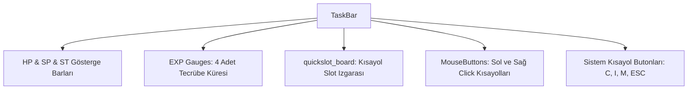

# 🎓 Metin2 Skills: `taskbar.py (Ana HUD Görev Kısayol Barı)`

Oyun ekranının alt kısmında kalıcı olarak duran, karakter durumlarını gösteren ve temel pencerelere erişim sağlayan ana kontrol barıdır.

---

## 🔍 Neleri Yönetir?

### 1. HP & SP & ST Barları: Sağlık, Mana ve Dayanıklılık durumlarının doluluk barları.
### 2. Tecrübe Küreleri (EXPGauge): Seviye atlamak için gereken tecrübe oranını gösteren 4 küre.
### 3. Hızlı Slot Bölümü (quickslot_board): Beceri, iksir ve eşya kısayollarının yerleştirildiği slotlar.
### 4. Mouse Butonları: Sol ve Sağ tıklamalarda tetiklenen beceri/saldırı kısayolları.
### 5. Menü Butonları: Karakter (C), Envanter (I), Fısıltı (M) ve Sistem (ESC) butonları.

---

## 🛠️ Modifikasyon ve Kritik Uyarılar

### ⚠️ HUD Temaları:
 Görev çubuğunun görselliğini değiştirmek için ymir work/ui/game/taskbar/ altındaki görsellerin yolları veya kendileri değiştirilmelidir.

### ⚠️ Kısayol Slot Sayısı:
 Kısayol sayısını artırmak için hızlı slot ızgarasının sütun sayıları ve koordinatları düzenlenebilir.

---

## 📉 Yapı Şeması

---

**Sonuç:** taskbar.py, oyun boyunca oyuncunun gözünün önünde olan en kritik HUD bileşenidir.
