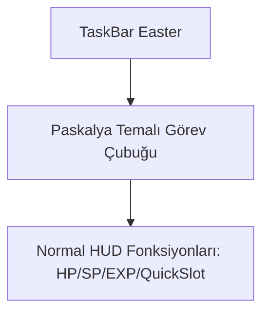

# 🎓 Metin2 Skills: `taskbar_easter.py (Paskalya Temalı Görev Barı)`

Paskalya etkinliği dönemlerinde kullanılmak üzere tasarlanmış, Paskalya süslemeleri ve renklerine sahip alternatif görev barıdır.

---

## 🔍 Neleri Yönetir?

### 1. Paskalya Tasarımı: Normal taskbar fonksiyonlarını birebir korurken, görselleri Paskalya temalı (tavşanlar, yumurtalar, çiçekler vb.) resimlerle değiştirir.

---

## 🛠️ Modifikasyon ve Kritik Uyarılar

### ⚠️ Temayı Değiştirme:
 İstemci içindeki etkinlik tetikleyicisi bu dosyayı çağırarak görev barının temasını dinamik olarak değiştirir.

---

## 📉 Yapı Şeması

---

**Sonuç:** taskbar_easter.py, Paskalya etkinliklerinde oyuna tematik ve canlı bir hava katar.
