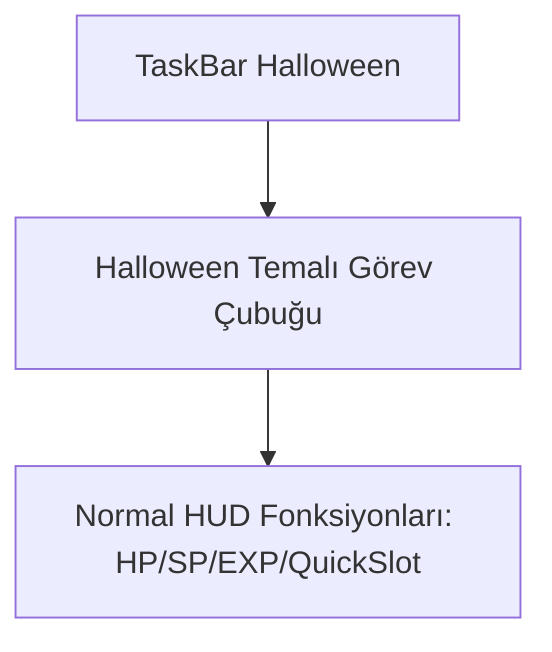

# 🎓 Metin2 Skills: `taskbar_haloween.py (Cadılar Bayramı Temalı Görev Barı)`

Cadılar Bayramı döneminde oyunu tematik hale getirmek için tasarlanmış korku ve balkabağı görsellerine sahip alternatif görev barıdır.

---

## 🔍 Neleri Yönetir?

### 1. Halloween Süslemeleri: Balkabakları, yarasalar ve karanlık tonlarda HUD butonları.
### 2. Fonksiyonel Uyum: Sağlık, Mana, EXP ve Hızlı slotların konumlarını bozmadan sadece görsel kaplamayı değiştirir.

---

## 🛠️ Modifikasyon ve Kritik Uyarılar

### ⚠️ Özel Halloween Görselleri:
 Balkabağı ikonlarının ve bar sınırlarının yerlerini değiştirmek için koordinat tabloları güncellenebilir.

---

## 📉 Yapı Şeması

---

**Sonuç:** taskbar_haloween.py, Cadılar Bayramı etkinliklerinde sunucunun atmosferini güçlendiren bir tasarımdır.
