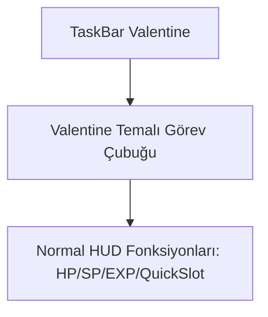

# 🎓 Metin2 Skills: `taskbar_valentine.py (Sevgililer Günü Temalı Görev Barı)`

Sevgililer Günü döneminde kullanılan, kalpli süslemeler ve kırmızı/pembe tonlara sahip alternatif görev barı tasarımıdır.

---

## 🔍 Neleri Yönetir?

### 1. Sevgililer Günü Tasarımı: Kalpler, aşk sembolleri ve pembe/kırmızı detaylı HUD buton görselleri.

---

## 🛠️ Modifikasyon ve Kritik Uyarılar

### ⚠️ Tema Yönetimi:
 Sevgililer günü döneminde bu görev çubuğu aktif edilerek arayüz temalandırılır.

---

## 📉 Yapı Şeması

---

**Sonuç:** taskbar_valentine.py, Sevgililer Günü etkinlikleri için tasarlanmış özel bir HUD alternatifidir.
