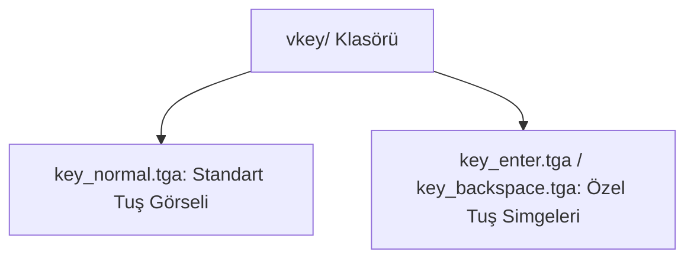

# 🎓 Metin2 Skills: `vkey/ Klasörü (Sanal Klavye Tuş Görselleri)`

Giriş ekranında (loginwindow) şifre yazarken kullanılan sanal tuş takımının (Virtual Keyboard) tuş görsellerini barındırır.

---

## 🔍 Neleri Yönetir?

### 1. key_normal.tga, key_normal_dn.tga, key_normal_over.tga: Standart karakter tuşlarının normal, basılı ve hover durum görselleri.
### 2. key_enter.tga, key_backspace.tga, key_shift.tga, key_space.tga: Özel fonksiyon tuşlarının görselleri.

---

## 🛠️ Modifikasyon ve Kritik Uyarılar

### ✅ Tuş Tasarımı:
 Sanal klavyenin buton tasarımlarını değiştirmek için buradaki tga dosyaları düzenlenebilir.

---

## 📉 Yapı Şeması

---

**Sonuç:** vkey/ klasörü, sanal klavye tuş takımının tüm tıklanabilir görsel durumlarını sağlar.
