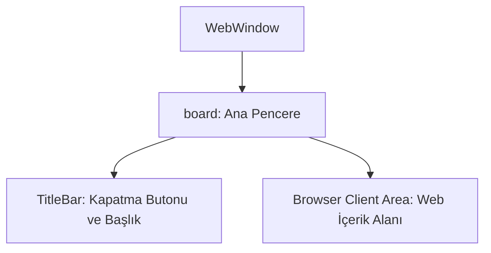

# 🎓 Metin2 Skills: `webwindow.py (Oyun İçi Web Nesne Market Tarayıcısı)`

Oyun içi Nesne Market (Mall) penceresini açan entegre tarayıcının arayüz çerçeve tasarımıdır.

---

## 🔍 Neleri Yönetir?

### 1. Pencere Çerçevesi (board): Tarayıcı ekranını kaplayan kalın tahta çerçeve.
### 2. Başlık Çubuğu (TitleBar): Pencereyi kapatma butonu ve Nesne Market başlığı.
### 3. Tarayıcı Alanı (MallWindow): Web sitesinin yüklendiği ve görüntülendiği istemci alanı.

---

## 🛠️ Modifikasyon ve Kritik Uyarılar

### ⚠️ Tarayıcı Boyutlandırması:
 Nesne market web sitelerinin sığmama veya taşma sorunlarını çözmek için width ve height değerleri sitenizin çözünürlüğüne göre güncellenmelidir.

---

## 📉 Yapı Şeması

---

**Sonuç:** webwindow.py, web nesne marketini oyundan çıkış yapmadan oyun içerisine güvenle entegre eder.
