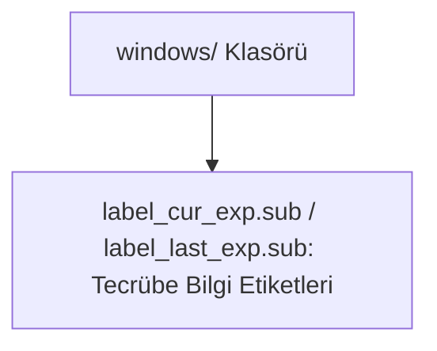

# 🎓 Metin2 Skills: `windows/ Klasörü (Ortak UI Etiket ve Çerçeve Görselleri)`

İstemci genelinde çeşitli oyun pencerelerinde kullanılan bilgilendirme etiketleri ve ufak panel parçalarının koordinat tanımlarını içerir.

---

## 🔍 Neleri Yönetir?

### 1. label_cur_exp.sub, label_last_exp.sub: Tecrübe göstergesi üzerine gelindiğinde veya envanterde gösterilen tecrübe etiketi görselleri.
### 2. label_ext.sub, label_ext_item1.sub: Ekstra panel veya eşya detay bilgilendirme etiketlerinin koordinatları.

---

## 🛠️ Modifikasyon ve Kritik Uyarılar

### ✅ Arayüz Etiketleri:
 Çeşitli pencerelerdeki bilgi paneli başlıklarını veya etiketlerini değiştirmek için buradaki sub dosyaları güncellenmelidir.

---

## 📉 Yapı Şeması

---

**Sonuç:** windows/ klasörü, arayüzdeki bilgilendirici paneller ve tecrübe etiketleri için ortak görsel koordinat kaynaklarını barındırır.
