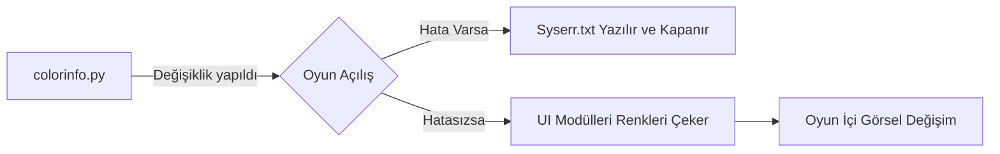

# 🎓 Metin2 Skills: `colorinfo.py` (Renk Yönetimi)

Bu dosya, oyunun "Paleti"dir. Buradaki sayıları değiştirerek oyunun tüm atmosferini (Sohbet renkleri, isim renkleri vb.) değiştirebilirsin.

---

## 🔍 Hangi Satır Neyi Değiştirir?

| Değişken Adı | Ne İşe Yarar? | Öneri |
| :--- | :--- | :--- |
| `CHAT_RGB_NOTICE` | Alttan geçen sarı/beyaz duyurular. | Daha dikkat çekici bir renk (örn: Parlak Yeşil) yapılabilir. |
| `CHAT_RGB_WHISPER` | Fısıltı mesajlarının rengi. | Standart yeşildir, mor veya pembe tonları popülerdir. |
| `CHR_NAME_RGB_PK` | Derecesi "Zalim" veya "Agresif" olanların isim rengi. | Kırmızının daha koyu bir tonu yapılabilir. |
| `TITLE_RGB_GOOD_4` | "Kahraman" derecesindeki oyuncunun yazı rengi. | Turkuaz veya Altın sarısı yapılabilir. |

---

## 🛠️ Nasıl Hatasız Değiştirilir? (Modlama Notları)

### ✅ Doğru Format:
`DEGISKEN_ADI = (Kırmızı, Yeşil, Mavi)`
Örnek: `CHAT_RGB_TALK = (255, 255, 255)` -> Saf Beyaz.

### ⚠️ Dikkat: Oyunun Açılmama Sebepleri:
1.  **Virgül Unutmak:** `(255, 255 255)` yazarsan Python hata verir ve oyun açılırken kapanır.
2.  **Parantez Kapatmamak:** `(255, 255, 255` yazmak en sık yapılan hatadır.
3.  **Sayı Aralığı:** Değerler **0 ile 255** arasında olmalıdır. `(300, 0, 0)` yazarsan oyun motoru bunu anlamayabilir ve siyah gösterebilir.

---

## 🚀 Örnek: Fısıltı Rengini "Neon Pembe" Yapmak
`CHAT_RGB_WHISPER = (255, 0, 255)` satırını bu şekilde değiştirirsen, oyundaki tüm fısıltılar anında neon pembe olur.

---

## 📉 Bağlantı Şeması

