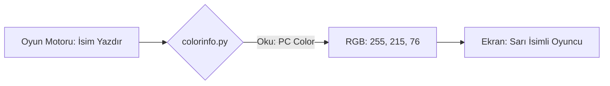

# 🎓 Metin2 Skills: `colorinfo.py` (Renk Yapılandırması)

`colorinfo.py`, oyun içindeki sohbet mesajlarının, oyuncu isimlerinin ve derece (karma) unvanlarının renklerini RGB formatında tanımlayan merkezi bir dosyadır.

---

## 🔍 Neleri Yönetir?

### 1. Sohbet Renkleri (`CHAT_RGB_*`)
Sohbet satırındaki mesaj türlerine göre renkleri belirler:
- **`TALK`**: Beyaz (Genel konuşma).
- **`GUILD`**: Sarı (Lonca konuşması).
- **`WHISPER`**: Yeşil (Fısıltı).
- **`SHOUT`**: Turkuaz (Bağırma).

### 2. İsim Renkleri (`CHR_NAME_RGB_*`)
Karakterlerin üzerindeki isimlerin rengini belirler:
- **`MOB`**: Kırmızı (Düşmanlar).
- **`NPC`**: Yeşil (Dost birimler).
- **`PC`**: Altın sarısı (Oyuncular).
- **`PK`**: Kahverengi (Katil oyuncular).

### 3. Derece Renkleri (`TITLE_RGB_*`)
Oyuncuların karmasına göre (Kahraman, Soylu, Zalim vb.) isimlerinin yanında beliren unvan renklerini yönetir.

---

## 🛠️ Modifikasyon ve Kritik Uyarılar

### ✅ Özel Renk Teması:
Sunucuna özel bir renk teması oluşturmak istiyorsan buradaki RGB değerlerini (`R, G, B`) değiştirebilirsin. Örneğin Bağırma rengini (`SHOUT`) mor yapmak için `(255, 0, 255)` değerini atayabilirsin.

### ⚠️ İmparatorluk Renkleri:
`EMPIRE_PC_A, B, C` değerleri, imparatorluk savaşlarında veya haritalarında rakip krallıkların isimlerinin hangi renkte (Örn: Kırmızı, Sarı, Mavi) görüneceğini belirler.

---

## 📉 colorinfo.py Veri Akışı

---

**Veri Akışı:** `root/ui.py` -> `colorinfo.py` -> `Oyun Motoru (Renderer)`.
