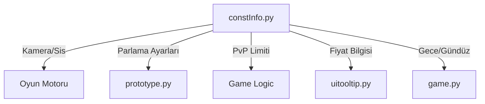

# 🎓 Metin2 Skills: `constInfo.py` (Global Ayarlar)

`constInfo.py`, oyunun "Kontrol Paneli"dir. Oyunun mekaniklerini (Kamera mesafesi, Sis, PvP limitleri) ve birçok sistemin aktif/pasif durumunu tek bir yerden yönetmeni sağlar.

---

## 🔍 Hangi Ayar Neyi Değiştirir?

| Değişken | Açıklama | Değiştirirsen Ne Olur? |
| :--- | :--- | :--- |
| `CAMERA_MAX_DISTANCE` | Kameranın en fazla ne kadar uzaklaşabileceği. | Değeri artırırsan (örn: 5500.0) haritayı çok daha geniş görebilirsin. |
| `FOG_LEVEL` | Sis seviyesi. | Değeri artırırsan (örn: 15000.0) sis kaybolur, ufuk çizgisi netleşir. |
| `PVPMODE_PROTECTED_LEVEL` | Serbest açma ve saldırıya uğrama limiti. | Bunu 1 yaparsan herkes birbirine her seviyede dalabilir. |
| `ARMOR_SPECULAR_ENABLE` | Zırh parlamaları. | 0 yaparsan zırhlar mat görünür, 1 yaparsan parlar. |
| `ENVIRONMENT_NIGHT` | Gece modu dosyası. | Buradaki dosya yolunu değiştirerek gece gökyüzünü değiştirebilirsin. |

---

## 🛠️ Modifikasyon ve Kritik Uyarılar

### ✅ Kamera Mesafesini Artırmak (Zoom Hack Değil, Ayardır):
`CAMERA_MAX_DISTANCE_LONG = 3500.0` satırını `8500.0` yaparsan, farenin tekerleğiyle çok daha geriye gidebilirsin. Bu, büyük haritalarda yolu görmek için çok kullanışlıdır.

### ⚠️ PvP Limitlerine Dikkat!
`PVPMODE_PROTECTED_LEVEL = 15`
Eğer bunu çok yüksek yaparsan (örneğin 99), sunucuda kimse kimseye saldıramaz. Oyuncuların rekabet etmesini istiyorsan 15 veya 30 idealdir.

---

## 🚨 Hata Ayıklama (Debug)

**Oyun açılırken `NameError: global name 'app' is not defined` hatası alıyorsanız:**
Bu dosyada `import app` ve `import net` satırlarının en üstte veya fonksiyonlardan önce olduğundan emin olmalısın. Python, kütüphaneyi tanımadan o kütüphaneye ait bir fonksiyonu (örn: `app.SetMinFog`) çalıştıramaz.

---

## 📉 constInfo.py Etki Alanı

---

**Sonuç:** `constInfo.py`, oyunun dengesini (balansını) sağlayan en önemli dosyadır. Buradaki küçük bir rakam değişikliği, tüm oyuncuların deneyimini kökten etkileyebilir.
