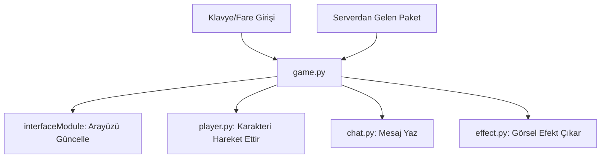

# 🎓 Metin2 Skills: `game.py` (Oyunun Ana Kalbi)

`game.py`, oyunun en büyük ve en karmaşık dosyasıdır. Oyuncunun dünyadaki her hareketi, bastığı her tuş ve sunucudan gelen her anlık veri buradan geçer.

---

## 🔍 Neleri Yönetir?

### 1. Klavye Kısayolları (`__BuildKeyDict`)
Oyundaki tüm tuş atamaları burada yapılır.
- **W, A, S, D:** Hareket.
- **I:** Envanter, **C:** Karakter, **M:** Harita.
- **F5:** Bu client'a özel olarak Efsun Botu (`Switchbot`) atanmış.
- **SPACE:** Saldırı.
- **Z / ~:** Yerden eşya toplama.

### 2. UI Bileşenlerinin Bağlanması
Envanter, minimap, hedef tahtası (TargetBoard) ve yeteneklerin (Skill) görsel arayüzleri burada `interfaceModule` üzerinden başlatılır ve birbirine bağlanır.

### 3. Kamera ve Görüntü Ayarları
Kameranın açısı, yüksekliği ve `constInfo.py`'den gelen limitlerin oyuna uygulanması burada gerçekleşir.

---

## 🛠️ Modifikasyon ve Kritik Uyarılar

### ✅ Yeni Bir Kısayol Tuşu Eklemek:
`__BuildKeyDict` fonksiyonu içine yeni bir satır ekleyerek oyuna yeni bir özellik katabilirsin.
- **Örnek:** `onPressKeyDict[app.DIK_F6] = lambda : self.BenimSistemim()`
- Bu satırı ekledikten sonra `BenimSistemim` adında bir fonksiyon yazarak F6 tuşuna basıldığında ne olacağını belirleyebilirsin.

### ✅ FPS ve Bilgi Ekranı:
Bu client'ta 124. satırda özel bir FPS göstergesi eklenmiş. Sen de buraya benzer kodlar ekleyerek ekrana anlık koordinat veya ping bilgisi yazdırabilirsin.

### ⚠️ Kod Kalabalığı ve Hatalar:
`game.py` 2000 satırdan fazla olduğu için bir yere yanlışlıkla fazladan bir boşluk bırakmak (Indentation Error) tüm oyunun bozulmasına sebep olur.
- **Tavsiye:** Değişiklik yapmadan önce mutlaka yedeğini al!

---

## 🚨 Hata Ayıklama (Debug)

**"Oyuna giriyorum ama karakter hareket etmiyor" sorunu:**
1.  `OnKeyDown` veya `__BuildKeyDict` kısmında bir hata olup olmadığını kontrol et.
2.  `syserr.txt` dosyasında `GameWindow.Open` hatası varsa, oyunun başlatılması sırasında bir modül (örn: envanter veya karakter penceresi) yüklenememiş demektir.

---

## 📉 game.py Etkileşim Şeması

---

**Sonuç:** `game.py`, oyunun orkestra şefidir. Diğer tüm `root` dosyaları bu şefe bağlı birer enstrüman gibi çalışır.
