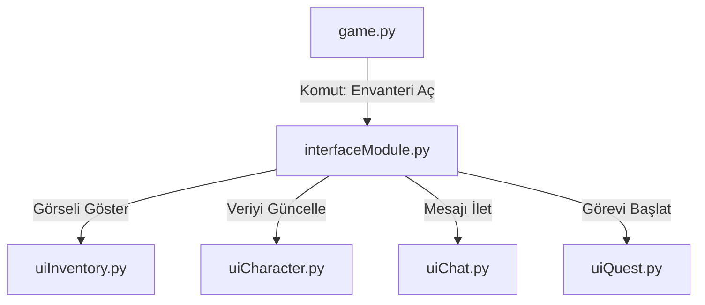

# 🎓 Metin2 Skills: `interfaceModule.py` (Arayüz Yöneticisi)

`interfaceModule.py`, oyundaki tüm pencerelerin (Envanter, Karakter, Chat vb.) "Şefi"dir. Bu pencerelerin oluşturulması, ekranda gösterilmesi veya kapatılması buradan yönetilir.

---

## 🔍 Neleri Yönetir?

### 1. Pencerelerin Oluşturulması (`__Make` Fonksiyonları)
Oyun açıldığında her pencere için birer fonksiyon çalışır:
- `__MakeInventoryWindow()`: Envanteri hazırlar.
- `__MakeChatWindow()`: Sohbet penceresini hazırlar.
- Bu pencereler oluşturulur ama oyuncu tuşa basana kadar gizli (`Hide`) tutulur.

### 2. Pencere Kontrolleri (Toggle)
`game.py`'den gelen tuş komutlarını karşılar.
- **İşleyiş:** Oyuncu "I" tuşuna bastığında, `game.py` buradaki `ToggleInventoryWindow()` fonksiyonunu çağırır. Bu fonksiyon da envanter açıksa kapatır, kapalıysa açar.

### 3. Quest Pencereleri
Sunucudan gelen görev (Quest) butonları ve konuşma pencereleri burada dinamik olarak oluşturulur ve listelenir.

---

## 🛠️ Modifikasyon ve Kritik Uyarılar

### ✅ Yeni Bir Sistem/Pencere Eklemek:
Oyuna yeni bir sistem (örn: Uzaktan Market) eklediğinde izlemen gereken adımlar:
1.  Pencere değişkenini `__init__` kısmında tanımla: `self.wndMarket = None`
2.  `MakeInterface` içinde pencereyi oluştur: `self.wndMarket = uiMarket.MarketWindow()`
3.  `ToggleMarketWindow` adında bir fonksiyon yazarak açma/kapama mantığını kur.

### ⚠️ Import Hataları:
Bu dosyanın en üstünde onlarca `import uiInventory`, `import uiChat` gibi satırlar bulunur. Eğer yeni bir `.py` dosyası oluşturup buraya import etmeyi unutursan, oyun `AttributeError` hatası verir ve karakter ekranından sonra oyuna girmez.

---

## 🚨 Hata Ayıklama (Debug)

**"Envanter tuşuna basıyorum ama açılmıyor" sorunu:**
1.  `interfaceModule.py` içinde `ToggleInventoryWindow` fonksiyonunu bul.
2.  Eğer orada bir `try-except` bloğu varsa, hatayı yutuyor olabilir. `syserr.txt` dosyasını kontrol ederek hangi alt modülün (örn: `uiInventory.py`) hata verdiğini bulmalısın.

---

## 📉 interfaceModule.py İlişki Şeması

---

**Sonuç:** `interfaceModule.py`, oyunun "Masaüstü" gibidir. Tüm pencereler bu masaüstü üzerinde düzenli bir şekilde çalışır.
