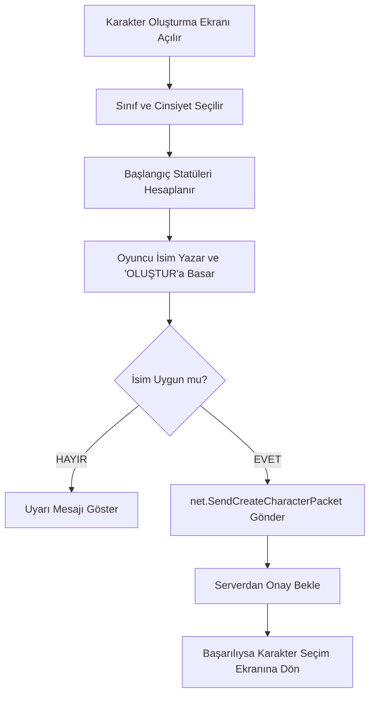

# 🎓 Metin2 Skills: `introCreate.py` (Karakter Oluşturma Ekranı)

`introCreate.py`, oyuncunun yeni bir maceraya başlamadan önce karakterinin sınıfını, cinsiyetini ve başlangıç özelliklerini belirlediği yerdir.

---

## 🔍 Neleri Değiştirebilirsin?

### 1. Başlangıç Statüleri (`START_STAT`)
Her sınıfın (Savaşçı, Ninja, Sura, Şaman) oyuna başlarken sahip olduğu CON (Yaşam Enerjisi), INT (Zeka), STR (Güç) ve DEX (Çeviklik) değerlerini buradan ayarlarsın.
- **Örnek:** Sura sınıfının daha fazla zeka ile başlamasını istiyorsan, ilgili listedeki 3. satırı güncelleyebilirsin.

### 2. İsim Kısıtlamaları (`__CheckCreateCharacter`)
Oyuncuların hangi isimleri alıp alamayacağını buradan kontrol edersin.
- **GM İsimleri:** İçinde "GM" geçen isimlerin alınmasını engelleyen kontrol buradadır.
- **Küfür Filtresi:** `net.IsInsultIn(name)` fonksiyonu ile serverdaki küfür listesine göre kontrol yapar.

### 3. Sınıf Açıklamaları
Karakter seçerken sağ tarafta çıkan "Savaşçı yakından dövüşür..." gibi açıklamaların hangi dosyadan okunacağı `DESCRIPTION_FILE_NAME` kısmında belirtilir.

---

## 🛠️ Modifikasyon ve Kritik Uyarılar

### ✅ Statü Puanlarını Değiştirmek:
`START_STAT` tablosundaki rakamları değiştirerek sınıflar arası dengeyi (Balance) oyunun en başında kurabilirsin. 
- **Not:** Toplam puanın tüm sınıflar için adil olduğundan emin olmalısın.

### ⚠️ İsim Hataları:
Eğer isim kontrol fonksiyonunu (`__CheckCreateCharacter`) yanlış düzenlersen, oyuncular boş isimle karakter açabilir veya hiç karakter açamayabilirler. Bu da veritabanında (DB) hatalara yol açar.

---

## 🚨 Hata Ayıklama (Debug)

**"Karakter oluştur'a basıyorum ama tepki vermiyor" sorunu:**
1.  `net.SendCreateCharacterPacket` satırına kadar kodun ulaşıp ulaşmadığını kontrol et.
2.  Eğer isimde geçersiz bir karakter varsa veya sunucu o ismi reddediyorsa, `OnCreateFailure` fonksiyonu çalışır ve hata mesajı gösterir.

---

## 📉 introCreate.py Çalışma Akışı

---

**Sonuç:** `introCreate.py`, oyunun "Doğumhanesi"dir. Buradaki ayarlar, oyuncunun karakterinin temel taşlarını (statü ve sınıf) belirler.
