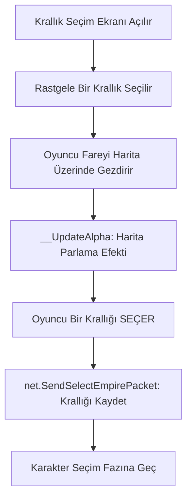

# 🎓 Metin2 Skills: `introEmpire.py` (Krallık Seçim Ekranı)

`introEmpire.py`, oyuncunun Shinsoo (Kırmızı), Chunjo (Sarı) veya Jinno (Mavi) krallıklarından birini seçtiği arayüzdür.

---

## 🔍 Neleri Değiştirebilirsin?

### 1. Krallık Açıklamaları
Her krallığın hikayesini ve özelliklerini anlatan metinlerin hangi dosyadan okunacağını belirler.
- **Değişken:** `EMPIRE_DESCRIPTION_TEXT_FILE_NAME`
- **İpucu:** Eğer krallıkların özelliklerini (örn: "Mavi Krallık ticaret merkezidir") değiştirmek istiyorsan, buradaki dosya yollarını takip etmelisin.

### 2. Görsel Efektler (Alpha/Saydamlık)
Harita üzerinde bir krallığın üzerine geldiğinde haritanın parlamasını veya bayrağın belirginleşmesini sağlar.
- **Fonksiyon:** `__UpdateAlpha`
- **Değiştirirsen:** Geçişlerin ne kadar hızlı veya yumuşak olacağını (fading hızı) ayarlayabilirsin.

---

## 🛠️ Modifikasyon ve Kritik Uyarılar

### ✅ Varsayılan Krallığı Belirlemek:
Oyun açıldığında rastgele bir krallık seçili gelir: `self.empireID = app.GetRandom(1, 3)`. 
- Eğer her oyuncunun ilk olarak Mavi Krallığı görmesini istiyorsan, burayı `self.empireID = 3` olarak sabitleyebilirsin.

### ⚠️ Faz Hataları:
Krallık seçildikten sonra `self.stream.SetSelectCharacterPhase()` çağrılır. Eğer krallık seçimi düzgün yapılmazsa veya paket gönderilemezse, oyuncu karakter seçme ekranına geçemez ve ekranda kalır.

---

## 🚨 Hata Ayıklama (Debug)

**"Krallık seçme ekranında butonlar çalışmıyor" sorunu:**
1.  `SelectEmpireWindow.py` (UIScript içindeki) dosyasındaki buton isimleriyle `introEmpire.py` içindeki `GetObject` isimlerinin eşleştiğinden emin ol.
2.  `net.SendSelectEmpirePacket` fonksiyonunun sunucudan onay alıp almadığını kontrol et.

---

## 📉 introEmpire.py Çalışma Akışı

---

**Sonuç:** `introEmpire.py`, oyunun siyasi haritasıdır. Buradaki görsellik ve hikaye anlatımı, oyuncunun hangi topluluğa ait hissedeceğini belirler.
