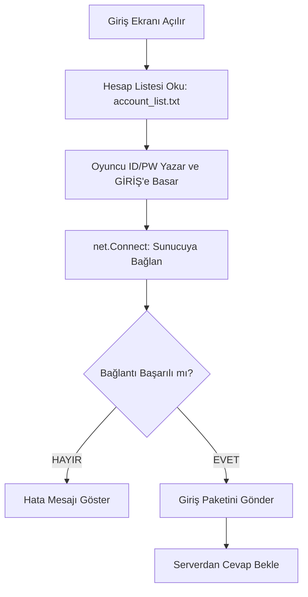

# 🎓 Metin2 Skills: `introLogin.py` (Giriş Ekranı Mantığı)

`introLogin.py`, oyuncunun sunucuyla ilk temas kurduğu yerdir. Kullanıcı adı ve şifrenin girilmesi, bu bilgilerin doğrulanması ve hangi sunucuya bağlanılacağının kararı burada verilir.

---

## 🔍 Neleri Değiştirebilirsin?

### 1. Sunucu Bilgileri (IP ve Portlar)
En çok merak edilen yer burasıdır. `LoginWindow` sınıfı içinde `connection` sözlüğü bulunur:
```python
connection = {
    "servername" : "Server İsmi",
    "ip" : "77.83.37.241",
    "auth" : 11002,
    "channel" : [13000, 16000, ...],
}
```
- **Değiştirirsen:** İstemcinin (Client) hangi sunucuya bağlanacağını belirlersin. Buradaki IP'yi kendi sunucunla değiştirerek oyuna girişi sağlayabilirsin.

### 2. Hesap Kayıt Sistemi (Auto-Login)
Bu dosyada `account_list.txt` dosyasını okuyan ve yazan fonksiyonlar bulunur.
- **İşlevi:** Oyuncunun "Hesabı Kaydet" butonuna bastığında şifresinin Base64 ile şifrelenip dosyaya yazılmasını sağlar.

---

## 🛠️ Modifikasyon ve Kritik Uyarılar

### ✅ Yeni Bir Kanal (CH) Eklemek:
`channel` listesinin içine yeni bir port eklemen yeterlidir: `[13000, 16000, 19000, 21000, 24000]`. Tabii ki sunucu tarafında da bu kanalın açık olması gerekir.

### ⚠️ Şifreleme (Base64) Güvenliği:
Bu dosyadaki `encode` ve `decode` fonksiyonları şifreleri basit bir yöntemle saklar.
- **Uyarı:** Bu yöntem gerçek bir "şifreleme" değildir, sadece okunmasını zorlaştırır. Başka bir oyuncu `account_list.txt` dosyanızı ele geçirirse bu kodları kullanarak şifrenizi çözebilir.

---

## 🚨 Hata Ayıklama (Debug)

**"Sunucuya bağlanırken hata" mesajı alıyorsanız:**
1.  `introLogin.py` içindeki IP ve Port bilgilerini kontrol et.
2.  İnternet bağlantını ve sunucunun (Auth ve CH) açık olup olmadığını kontrol et.
3.  Eğer IP doğruysa ama hala hata alıyorsan, `syserr.txt` dosyasına bak; orada "Network Error" kodu yazar.

---

## 📉 introLogin.py Çalışma Akışı


---

**Sonuç:** `introLogin.py`, istemcinin "Kapı Eşiği"dir. Buradaki IP ve Port ayarları, istemcinin hangi dünyaya açılacağını belirleyen anahtardır.
