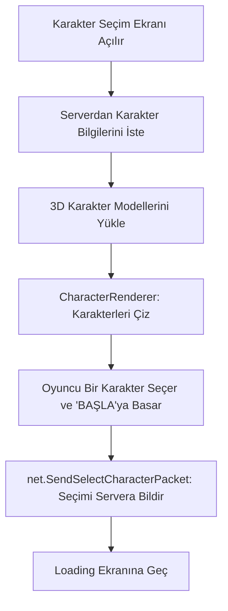

# 🎓 Metin2 Skills: `introSelect.py` (Karakter Seçme Ekranı)

`introSelect.py`, oyuncunun hesabındaki karakterleri 3D olarak gördüğü ve hangisiyle oyuna gireceğine karar verdiği ekrandır.

---

## 🔍 Neleri Değiştirebilirsin?

### 1. Karakter Slot Sayısı (`SLOT_COUNT`)
Hesabında kaç karakter olabileceğini buradan belirleyebilirsin.
- **Değişken:** `SLOT_COUNT = 4` (Bazı serverlarda 5 yapılır).
- **Önemli:** Burayı 5 yapmak yetmez, server (db) tarafının ve oyun binary dosyasının da 5 slotu desteklemesi gerekir.

### 2. Karakter Kamera Açısı
Karakterlerin seçim ekranında ne kadar yakın veya hangi açıda duracağını `CharacterRenderer` içindeki şu satır belirler:
- `app.SetCamera(1550.0, 15.0, 180.0, 95.0)`
- **Değiştirirsen:** Karakteri daha yakından görebilir veya yan profilden bakmasını sağlayabilirsin.

### 3. Karakter Dönüş Hızı ve Pozisyonu
`SLOT_ROTATION` listesindeki dereceler, her slotun (karakterin durduğu yerin) açısını belirler. Karakterler bir çember üzerinde dizilmiş gibidir.

---

## 🛠️ Modifikasyon ve Kritik Uyarılar

### ✅ Yeni Karakterleri Tanıtmak:
Oyuna yeni bir sınıf (örn: Lycan) eklendiğinde, `CHARACTER_TYPE_COUNT` değerini güncellemen gerekebilir.

### ⚠️ Render Hataları:
`grp.SetViewport(...)` ayarlarını yanlış yaparsan, karakterler ekranın dışına kayabilir veya hiç görünmeyebilir. Bu ayarlar, 3D karakterin ekranın tam olarak neresinde (Sol, Sağ, Orta) çizileceğini belirler.

---

## 🚨 Hata Ayıklama (Debug)

**"Karakterler görünmüyor ama isimleri yazıyor" sorunu:**
Bu sorun genellikle `CharacterRenderer` içindeki kamera veya viewport ayarlarının bozulmasından kaynaklanır. 3D model (MSM) yüklenemediğinde de karakterler "görünmez" (Invisible) olabilir.

---

## 📉 introSelect.py Çalışma Akışı

---

**Sonuç:** `introSelect.py`, oyuncunun kendi karakteriyle ilk bağ kurduğu yerdir. Buradaki görsel sunum (kamera açısı, ışıklandırma), oyunun kalitesini yansıtan önemli bir unsurdur.
