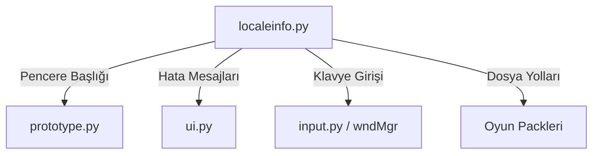

# 🎓 Metin2 Skills: `localeinfo.py` (Dil ve Yerelleştirme)

`localeinfo.py`, oyunun "Tercümanı"dır. Ekrandaki yazılardan, klavye düzenine ve oyunun hangi bölgede (Türkiye, Avrupa vb.) çalıştığına dair tüm dil ayarlarını barındırır.

---

## 🔍 Neleri Değiştirebilirsin?

### 1. Oyunun Pencere İsmi (`APP_TITLE`)
Oyun açıldığında üstte yazan ismi buradan değiştirebilirsin.
- **Değişken:** `APP_TITLE = "Senin Server İsmin"`
- **Sonuç:** Oyunu başlattığında pencere çubuğunda bu yazı görünür.

### 2. Klavye ve Karakter Düzeni
Oyunda bazı harflerin (Ö, Ç, Ş gibi) yazılmama sorunu genellikle buradaki `VIRTUAL_KEY_ALPHABET` satırlarından kaynaklanır.
- **İpucu:** Eğer oyuncuların Türkçe karakter yazamıyorsa, buradaki karakter dizilerine Türkçe karakterleri eklemen gerekir.

### 3. Lonca Ayarları
Lonca logosu koymak için gereken seviye gibi limitler burada tanımlıdır:
- `GUILD_MARK_MIN_LEVEL = "3"` -> Lonca seviyesi 3 olmadan logo koyulamaz.

---

## 🛠️ Modifikasyon ve Kritik Uyarılar

### ⚠️ Kodlama (Encoding) Hatası:
Bu dosya genellikle **ANSI** veya **UTF-8 (BOM'suz)** olarak kaydedilmelidir. Eğer yanlış bir formatta kaydedersen, oyundaki tüm Türkçe karakterler "" şeklinde görünür veya oyun hiç açılmaz.

### ✅ Hata Almadan Yazı Değiştirmek:
Dosyadaki mesajları değiştirirken tırnak işaretlerine (`" "`) dikkat etmelisiniz.
- **Doğru:** `LOGIN_FAILURE_BLOCK_LOGIN = "Hesabınız Engellendi"`
- **Yanlış:** `LOGIN_FAILURE_BLOCK_LOGIN = Hesabınız Engellendi` (Tırnak yoksa Python hata verir).

---

## 🚨 Sık Sorulan Sorular

**Soru:** Lonca seviyesini 1 yaptım ama hala 3 yazıyor?
**Cevap:** Sadece `GUILD_MARK_MIN_LEVEL`'i değiştirmek yetmez, altındaki `GUILD_MARK_NOT_ENOUGH_LEVEL` uyarı mesajını da oyuncuları yanıltmamak için güncellemelisin.

---

## 📉 localeinfo.py Kullanım Alanları

---

**Sonuç:** `localeinfo.py`, oyuncuyla iletişim kuran ana dosyadır. Buradaki metinleri Türkçeleştirerek veya özelleştirerek oyunun "dilini" tamamen değiştirebilirsin.
