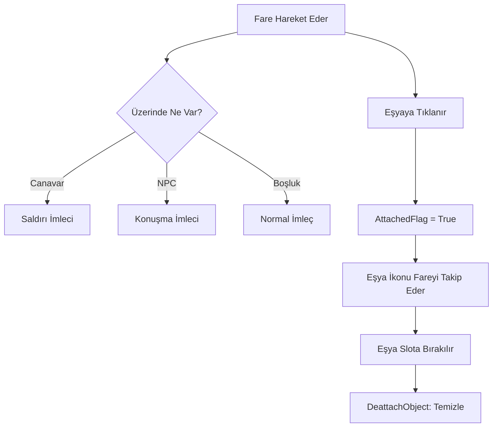

# 🎓 Metin2 Skills: `mousemodule.py` (Fare Kontrol ve Sürükleme Sistemi)

`mousemodule.py`, fare imlecinin (Cursor) görünümünü, hareketlerini ve envanterdeki eşyaların sürükle-bırak (Drag & Drop) mantığını yöneten temel dosyadır.

---

## 🔍 Neleri Yönetir?

### 1. Fare İmleci Durumları (`cursorDict`)
Fare, üzerine geldiği nesneye göre şekil değiştirir:
- **Normal:** Standart ok imleci.
- **Saldırı (`ATTACK`):** Canavarların üzerine gelince kılıç şeklini alır.
- **Konuşma (`TALK`):** NPC'lerin üzerine gelince konuşma balonu şeklini alır.
- **Toplama (`PICK`):** Yerden eşya alırken el şeklini alır.

### 2. Eşya Sürükleme (Attached Objects)
Envanterden bir eşyaya tıkladığında, o eşyanın ikonunun fareyi takip etmesini sağlar.
- **`AttachedIconHandle`**: Fareye "yapışan" eşyanın görseli.
- **`AttachedCount`**: Sürüklenen eşyanın sayısı (Örn: 200 adet Pot).

### 3. Yazılımsal vs Donanımsal İmleç
Windows'un kendi fare imlecini mi yoksa oyunun özel tasarlanmış imleçlerini mi kullanacağını `IsSoftwareCursor` ile belirler.

---

## 🛠️ Modifikasyon ve Kritik Uyarılar

### ✅ Özel İmleç Tasarımları:
`D:/Ymir Work/UI/Cursor/` klasöründeki `.sub` dosyalarını değiştirerek fare imlecini daha modern veya farklı renklerde yapabilirsin.

### ✅ Sürükleme Efektleri:
Eşyayı sürüklerken arkasında bir iz bırakması veya şeffaf görünmesi gibi görsel iyileştirmeler `Render` fonksiyonu içine eklenebilir.

### ⚠️ İmleç Kaybolma Hatası:
Eğer donanımsal imleç (Hardware Cursor) ayarı açıksa ama ekran kartı sürücüleriyle bir uyumsuzluk varsa fare imleci oyun içinde görünmeyebilir. Bu durumda `IsSoftwareCursor` zorunlu hale getirilebilir.

---

## 🚨 Hata Ayıklama (Debug)

**"Eşyayı envanterden alıyorum ama fareyle birlikte hareket etmiyor" sorunu:**
1.  `CMouseController` içindeki `AttachedFlag` değişkeninin `True` olup olmadığını kontrol et.
2.  `grpImage.Generate` fonksiyonunun eşya ikonunu doğru yükleyip yüklemediğini denetle.

---

## 📉 mousemodule.py İşlem Akışı

---

**Sonuç:** `mousemodule.py`, oyuncunun oyun dünyası ile etkileşim kuran "Eldivenidir". Her tıklama ve sürükleme işlemi bu dosyanın kontrolünden geçer.
