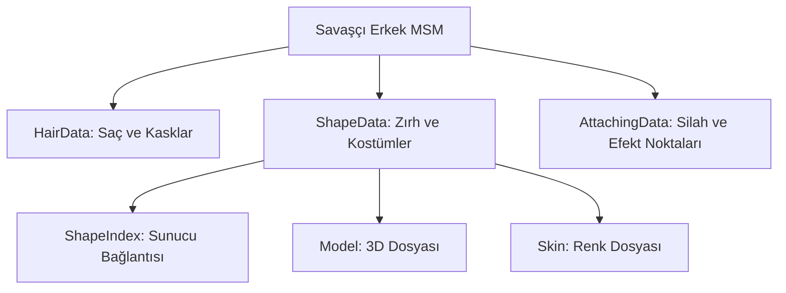

# 🎓 Metin2 Skills: `.msm` Dosyaları (Karakter Görsel Yapılandırması)

`.msm` dosyaları (Örn: `warrior_m.msm`), bir karakter sınıfının dış görünüşünü, giydiği zırhları, saç stillerini ve kemik yapısına bağlı olan efektlerin (Örn: Parlama) koordinatlarını belirleyen "Görsel Mimari" dosyalarıdır.

---

## 🔍 Neleri Yönetir?

### 1. Ana Model (`BaseModelFileName`)
Karakterin üzerinde hiçbir eşya yokken (çıplak halde) görünecek temel 3D model dosyasını (`.gr2`) belirler.

### 2. Saç Stilleri (`Group HairData`)
Oyundaki tüm saç stillerini ve kaskları birer ID (`HairIndex`) ile modellerle eşleştirir.
- **`HairIndex`**: Sunucu tarafındaki eşya koduyla bağlantılıdır.
- **`Model`**: Saçın 3D dosyası.
- **`TargetSkin`**: Saçın rengini belirleyen doku dosyası.

### 3. Zırh ve Kostüm Modelleri (`Group ShapeData`)
Envanterdeki bir zırhın karakterin üzerinde nasıl görüneceğini belirler.
- **`ShapeIndex`**: Sunucudaki `item_proto` dosyasının `value3` sütunuyla eşleşmek zorundadır.
- **`Model`**: Zırhın 3D dosyası.
- **`SourceSkin / TargetSkin`**: Aynı 3D modeli kullanarak farklı renklerde zırhlar (Örn: Keşiş Plaka ve Demir Plaka) oluşturulmasını sağlar.

### 4. Bağlantı Noktaları (`Group AttachingData`)
Silahların, parlamaların veya kanatların karakterin hangi kemiğine (El, Sırt, Ayak) takılacağını ve hangi açıyla duracağını belirler.

---

## 🛠️ Modifikasyon ve Kritik Uyarılar

### ✅ Yeni Zırh/Kostüm Ekleme:
Yeni bir zırh eklediğinde, ona bir `ShapeIndex` vermelisin. Bu numara daha önce kullanılmamış olmalı ve sunucudaki `value3` değeriyle aynı olmalıdır.

### ✅ Efekt Pozisyonlama:
Eğer bir efekt (Örn: Ayak izi efekti) karakterin çok yukarısında veya aşağısında çıkıyorsa, `AttachingData` içindeki `Position` (X, Y, Z) koordinatlarını buradan düzeltebilirsin.

### ⚠️ ShapeIndex Sınırı:
Eski oyun motorlarında `ShapeIndex` değeri belirli bir sınırı (Genelde 255 veya 65535) aşarsa karakterin zırhı görünmez olabilir.

---

## 🚨 Hata Ayıklama (Debug)

**"Zırhı giyiyorum ama karakter görünmez oluyor" sorunu:**
1.  `.msm` dosyasındaki `ShapeIndex` değerinin sunucudaki `value3` ile aynı olduğunu doğrula.
2.  `Model` satırındaki `.gr2` dosya yolunun doğru yazıldığından emin ol.
3.  Dosyanın en başındaki `ShapeDataCount` değerini, eklediğin yeni zırhlarla birlikte artırmayı unutma.

---

## 📉 .msm Dosyası Hiyerarşisi

---

**Sonuç:** `.msm` dosyaları, karakterin "Gardırobudur". Oyundaki tüm görsel çeşitlilik bu dosyaların doğru yapılandırılmasına bağlıdır.
