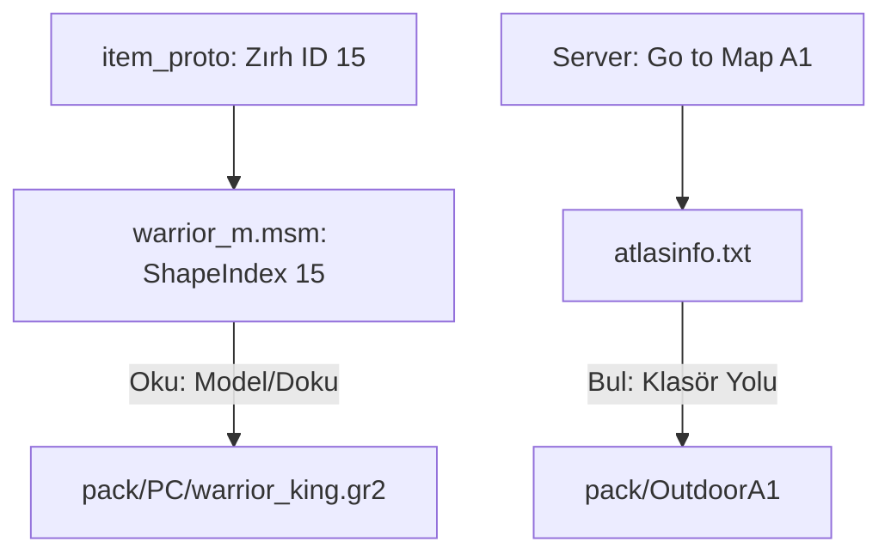

# 🎓 Metin2 Skills: `root` Yapılandırma Dosyaları (MSM ve TXT)

`root` klasörü sadece Python mantık dosyalarından oluşmaz; aynı zamanda karakterlerin görünümünü ve dünya haritasını tanımlayan kritik yapılandırma dosyalarını (`.msm` ve `.txt`) barındırır.

---

## 🔍 Neleri Yönetirler?

### 1. `.msm` (Motion Script Model - Karakter Yapılandırması)
Her karakter sınıfı ve cinsiyeti için bir dosya bulunur (Örn: `warrior_m.msm`).
- **`ShapeData`**: Karakterin giydiği zırhların hangi model (`.gr2`) ve dokuyu (`.dds`) kullanacağını ID bazlı eşleştirir.
- **`HairData`**: Saç stillerini ve kask görünümlerini yönetir.
- **`AttachingData`**: Silahların veya efektlerin karakterin neresine (eline, sırtına) takılacağını belirleyen kemik (Bone) bağlantılarını içerir.

### 2. `atlasinfo.txt` (Dünya Haritası Listesi)
Oyundaki tüm haritaların teknik isimlerini ve koordinatlarını barındırır.
- **`metin2_map_a1  0 0 3 3`**: Harita klasör adını ve haritanın dünya üzerindeki konumunu tanımlar. Işınlanma sistemi bu dosyayı referans alır.

### 3. `npclist.txt` (Model Eşleştirme)
`mob_proto` içindeki yaratık/NPC kodlarını, `pack` içindeki görsel klasörlerle eşleştirir.
- **`101 stray_dog`**: 101 nolu canavarın `stray_dog` klasöründeki modeli kullanmasını sağlar.

---

## 🛠️ Modifikasyon ve Kritik Uyarılar

### ✅ Yeni Zırh/Saç Ekleme:
Yeni bir zırh eklediğinde mutlaka ilgili `.msm` dosyasına yeni bir `ShapeIndex` bloğu eklemelisin. Aksi halde zırhı giydiğinde karakter beyaz görünür veya oyun çöker.

### ⚠️ TAB Karakteri:
`atlasinfo.txt` ve `npclist.txt` dosyalarında sütunlar arası boşluklar genellikle **TAB** karakteri ile verilir. Normal boşluk (Space) kullanılması istemcinin dosyayı yanlış okumasına neden olabilir.

---

## 📉 root Yapılandırma Veri Akışı

---

**Veri Akışı:** `proto` -> `root/*.msm` / `root/*.txt` -> `pack/Assets`.
