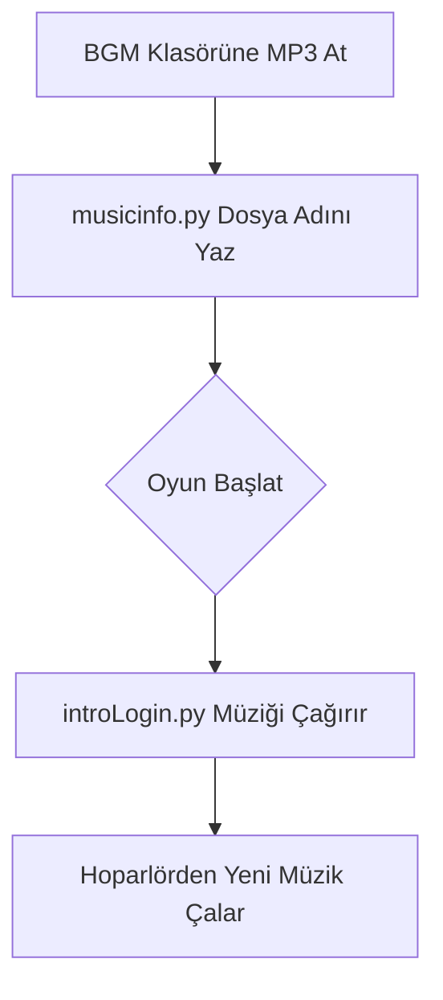

# 🎓 Metin2 Skills: `musicinfo.py` (Müzik Yönetimi)

Bu dosya oyunun "DJ Kabini"dir. Buradaki ayarlar sayesinde oyuncunun hangi ekranda hangi müziği duyacağını belirlersin.

---

## 🔍 Hangi Değişken Neyi Değiştirir?

| Değişken | Açıklama | Değiştirirsen Ne Olur? |
| :--- | :--- | :--- |
| `METIN2THEMA` | Ana tema dosyası. | Oyunun ilk açılışındaki o meşhur müziği değiştirirsin. |
| `loginMusic` | Giriş ekranı müziği. | Kullanıcı adı/şifre yazarken çalan müziği belirler. |
| `selectMusic` | Karakter seçme ekranı. | Karakterini seçerken atmosferi belirler. |

---

## 🛠️ Modifikasyon ve Güvenli Değişim Rehberi

### ✅ Yeni Müzik Ekleme Adımları:
1.  Kendi `.mp3` dosyanı oyunun ana dizinindeki `BGM` klasörüne at. (Örn: `benim_muzigim.mp3`)
2.  `musicinfo.py` içinde ilgili satırı güncelle:
    `loginMusic = "benim_muzigim.mp3"`
3.  Dosya adının tam olarak aynı olduğundan (Büyük/küçük harf dahil) emin ol.

### ⚠️ Sık Yapılan Hatalar ve Sonuçları:
- **Dosya Bulunamadı:** Eğer `BGM` klasöründe olmayan bir dosya adı yazarsan, o sahnede oyun sessiz kalır (Çökmez ama müzik çalmaz).
- **Format Hatası:** Sadece `.mp3` formatı kullanılması önerilir. `.wav` veya `.ogg` bazı packlerde sorun çıkarabilir.
- **Tırnak İşareti:** Dosya adını tırnak içinde yazmayı unutma: `loginMusic = yeni.mp3` -> **YANLIŞ**, `"yeni.mp3"` -> **DOĞRU**.

---

## 🧠 Gelişmiş İpucu: Son Müziği Hatırlama
`SaveLastPlayFieldMusic()` fonksiyonu sayesinde oyun, oyuncunun en son hangi harita müziğinde kaldığını hatırlar. Eğer her haritaya girildiğinde müziğin baştan başlamasını istiyorsan bu fonksiyonun içini boş bırakabilirsin (ancak önerilmez).

---

## 🚀 Değişim Sonrası Akış Şeması

