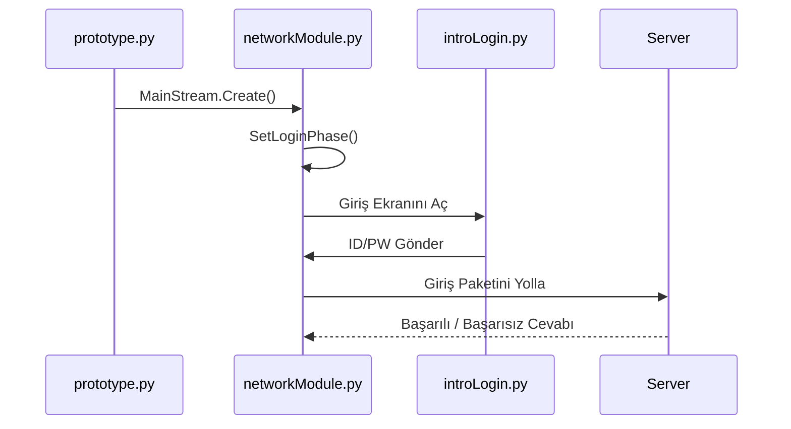

# 🎓 Metin2 Skills: `networkModule.py` (Ağ ve Faz Yönetimi)

`networkModule.py`, oyunun "Trafik Polisi"dir. Sunucu ile istemci (Client) arasındaki bağı kurar ve oyunun hangi aşamada (Giriş, Karakter Seçimi, Yükleme ekranı) olduğunu yönetir.

---

## 🔍 Neleri Yönetir?

### 1. Popup Diyaloglar
Oyunda gördüğünüz "Bağlanırken hata oluştu", "Şifre yanlış" gibi uyarı kutularının yapısı burada tanımlıdır.
- **Değiştirirsen:** Bu uyarı kutularının tasarımını veya buton metinlerini değiştirebilirsin.

### 2. Faz Değişimleri (Phase Management)
Oyunun bir aşamadan diğerine geçmesini sağlar. Örneğin:
- `SetLoginPhase()`: Giriş ekranını yükler.
- `SetGamePhase()`: Karakter seçildikten sonra haritayı ve oyun dünyasını yükler.

---

## 🛠️ Modifikasyon ve Kritik Uyarılar

### ✅ Ekran Geçişlerini (Perde) Özelleştirmek:
Oyunun bir ekrandan diğerine geçerken ekranın kararmasını sağlayan `uiPhaseCurtain` burada tetiklenir. Eğer geçişlerin çok yavaş veya çok hızlı olduğunu düşünüyorsan, faz değişim fonksiyonlarındaki `curtain` ayarlarını kurcalayabilirsin.

### ⚠️ Ağ Ayarları (BufferSize):
`net.SetTCPRecvBufferSize(128*1024)` gibi satırlar, sunucudan gelen verinin ne kadar büyük bir pakette alınacağını belirler. 
- **Uyarı:** Bu rakamları bilmeden değiştirmek, oyunda durduk yere oyundan atılmalara (Kick) veya aşırı gecikmelere (Lag) sebep olabilir.

---

## 🚨 Hata Ayıklama (Debug)

**"Karakter seçtikten sonra loading ekranında kalıyor" sorunu:**
Bu sorun genellikle `networkModule.py` içindeki `SetLoadingPhase` fonksiyonunun, oyun dünyasını (Map verilerini) yüklemek için gerekli modülleri (background, chrmgr) doğru şekilde tetikleyememesinden kaynaklanır.

---

## 📉 networkModule.py Akış Şeması

---

**Sonuç:** `networkModule.py`, oyunun sunucuyla olan "el sıkışma" sürecini yönetir. Buradaki bir hata, oyuncunun oyuna hiç girememesine veya giriş yaptıktan sonra "karakterde kalma" sorununa yol açar.
