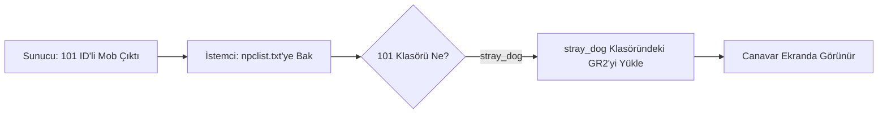

# 🎓 Metin2 Skills: `npclist.txt` (NPC ve Canavar Model Haritası)

`npclist.txt`, oyundaki sayısal VNUM değerlerini (Örn: 101) o canavarın 3D modellerinin bulunduğu klasör isimleriyle (Örn: `stray_dog`) eşleştiren kritik bir veri dosyasıdır.

---

## 🔍 Neleri Yönetir?

### 1. VNUM ve Klasör Eşleşmesi
Oyun motoru yerdeki bir canavarın VNUM'unu (ID) okuduğunda, bu dosyaya bakarak hangi 3D modeli (`.gr2`) ve animasyonları yükleyeceğine karar verir.
- **Örnek:** `101  stray_dog` satırı, 101 ID'li canavarın `share/data/monster/stray_dog` klasöründeki verileri kullanacağını söyler.

### 2. İsim Takma (Alias - VNUM 0)
ID'si 0 olan satırlar, klasör isimlerine kısa adlar takmak için kullanılır. Bu, diğer teknik dosyalarda (`playersettingmodule.py` gibi) klasör yolunu uzun uzun yazmak yerine kısa ismi kullanmaya olanak tanır.

### 3. Metin Taşları ve Nesneler
Sadece canlı yaratıklar değil, Metin taşları (62-77), maden damarları (37-53) ve binalar da burada tanımlıdır.

---

## 🛠️ Modifikasyon ve Kritik Uyarılar

### ✅ Yeni Canavar Ekleme:
Sunucu tarafında `mob_proto` dosyasına yeni bir yaratık eklediğinde, onun görselini oyunda görebilmek için mutlaka bu dosyaya yeni bir satır eklemelisin.

### ✅ Model Değiştirme (Reskin):
Var olan bir canavarın (Örn: Yabani Köpek) görünümünü değiştirmek için, onun VNUM'unun yanındaki klasör ismini başka bir canavarın klasörüyle değiştirmen yeterlidir.

### ⚠️ Boş Satırlar ve Sekmeler (Tab):
Bu dosya sekmelere (Tab) karşı hassastır. VNUM ile isim arasında mutlaka bir "Tab" boşluğu olmalıdır; normal boşluk (Space) bazen hatalara yol açabilir.

---

## 🚨 Hata Ayıklama (Debug)

**"Canavarın ismi görünüyor ama kendisi görünmez (veya beyaz)" sorunu:**
1.  `npclist.txt` içinde o canavarın VNUM'unun olup olmadığını kontrol et.
2.  Yazılan klasör isminin `monster` veya `npc` dizininde fiziksel olarak var olduğundan emin ol.

---

## 📉 npclist.txt Eşleşme Mantığı

---

**Sonuç:** `npclist.txt`, oyunun "Görsel Adres Defteridir". Kimin hangi kostümü/gövdeyi giyeceğini bu dosya söyler.
