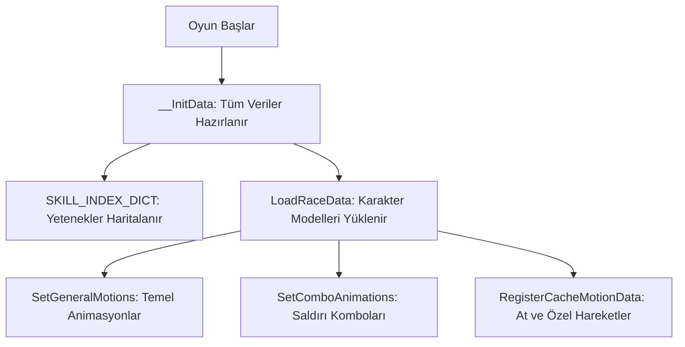

# 🎓 Metin2 Skills: `playersettingmodule.py` (Karakter Teknik Yapılandırması)

`playersettingmodule.py`, oyundaki tüm karakter sınıflarının (Savaşçı, Ninja vb.) teknik kalbidir. Animasyonların hangi dosyalardan yükleneceğini, becerilerin (Skill) ID numaralarını ve karakterlerin görsel özelliklerini belirler.

---

## 🔍 Neleri Yönetir?

### 1. Beceri Haritası (`SKILL_INDEX_DICT`)
Hangi karakter sınıfının hangi yeteneklere sahip olduğunu belirler. 
- **Örnek:** Savaşçı Bedensel grubunun yetenek ID'leri (1, 2, 3, 4, 5) burada tanımlıdır. Yeni bir yetenek eklendiğinde ilk durak burasıdır.

### 2. Animasyon Kaydı (`SetGeneralMotions`)
Karakterlerin temel hareketlerini (Bekleme, Yürüme, Koşma, Ölme) ilgili `.msa` dosyalarıyla eşleştirir.
- **`wait.msa`**: Boşta bekleme.
- **`run.msa`**: Koşma.
- **`damage.msa`**: Hasar alma efekti.

### 3. Irk ve Sınıf Tanımları (`RACE_` ve `JOB_`)
Oyun motorunun karakterleri tanıması için kullanılan sayısal ID'leri (Örn: Savaşçı Erkek = 0) tanımlar.

### 4. Yüz İkonları (`FACE_IMAGE_DICT`)
Sol üstteki karakter panelinde veya grup listesinde görünen küçük karakter yüzlerinin hangi `.sub` dosyasından okunacağını belirler.

---

## 🛠️ Modifikasyon ve Kritik Uyarılar

### ✅ Yeni Skill (6/7/8) Ekleme:
`SKILL_INDEX_DICT` içindeki listelere yeni ID'ler ekleyerek karakterlerin beceri ağacını genişletebilirsin. (Bunu yaparken sunucu taraflı `skill_proto` ile uyumlu olmalıdır).

### ✅ Yeni Animasyonlar:
Eğer elinde yeni bir dans animasyonu veya saldırı efekti varsa, bunu `chrmgr.RegisterCacheMotionData` ile sisteme tanıtabilirsin.

### ⚠️ Dosya Yolu Hataları:
Eğer bir `.msa` dosyasının yolu yanlış yazılırsa, o karakter o hareketi yapmaya çalıştığında oyun aniden kapanır (Crash) veya karakter "T-Pose" (hareketsiz) kalır.

---

## 🚨 Hata Ayıklama (Debug)

**"Karakterim koşarken animasyon oynamıyor" sorunu:**
1.  `SetGeneralMotions` içindeki `run.msa` dosyasının adını ve yolunu kontrol et.
2.  Karakterin `.msm` dosyasındaki klasör yolunun (`chrmgr.SetPathName`) doğru olduğundan emin ol.

---

## 📉 playersettingmodule.py Mantıksal Yapısı

---

**Sonuç:** `playersettingmodule.py`, karakterlerin "Genetik Kodudur". Onların nasıl görüneceğini ve nasıl hareket edeceğini belirleyen en temel dosyadır.
