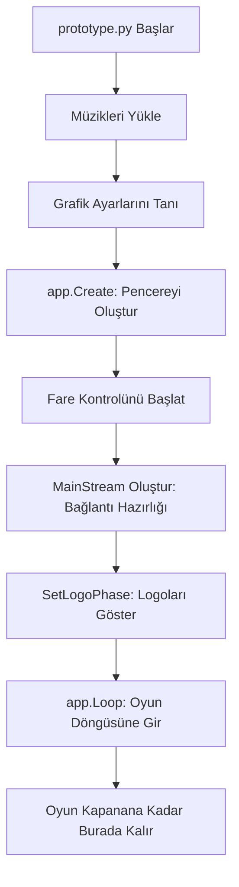

# 🎓 Metin2 Skills: `prototype.py` (Oyunun Kurulumu ve Başlatılması)

`prototype.py`, `system.py` tarafından ateşlenen fitilin ulaştığı ilk baruttur. Oyun penceresinin oluşturulması, farenin (mouse) tanıtılması ve oyunun hangi aşamadan (Logo, Login vb.) başlayacağının belirlendiği yerdir.

---

## 🔍 Neleri Değiştirebilirsin?

### 1. Oyunun Başlangıç Aşaması (Phases)
Oyunun direkt karakter seçme ekranından veya direkt oyundan (bazı testler için) başlamasını istiyorsan buradaki "Phase" ayarlarıyla oynarsın:

- **Standart:** `mainStream.SetLogoPhase()` (Logoları gösterir)
- **Hızlı Giriş İçin:** Bunu `mainStream.SetLoginPhase()` yaparak logoları atlayabilirsin.

### 2. Grafik Ayarları (Specular)
Dosya içindeki şu satırlar, zırhların ve silahların parlamasını (yansıma) kontrol eder:
```python
app.SetArmorSpecularEnable(constInfo.ARMOR_SPECULAR_ENABLE)
app.SetWeaponSpecularEnable(constInfo.WEAPON_SPECULAR_ENABLE)
```
- **İpucu:** Eğer `constInfo.py` dosyasında bunlar `1` ise parlar, `0` ise parlamaz.

---

## 🛠️ Modifikasyon ve Kritik Uyarılar

### ⚠️ Pencere Oluşturma Hatası (`app.Create`)
`app.Create(localeInfo.APP_TITLE, systemSetting.GetWidth(), systemSetting.GetHeight(), 1)`
Bu satır oyunun penceresini oluşturur. Eğer ekran kartın 3D grafiklerini desteklemiyorsa veya çözünürlük ayarların (systemSetting) yanlışsa, oyun burada **"Sorry, Your system does not support 3D graphics"** hatası verir.

### ✅ Pencere İsmini Değiştirmek:
Oyunun üst barında yazan ismi değiştirmek istersen, `localeInfo.APP_TITLE` yerine tırnak içinde kendi ismini yazabilirsin:
`app.Create("Benim Efsane Serverim", ...)`

---

## 🚨 Hata Ayıklama (Debug)

**Oyun açılır açılmaz hiçbir hata vermeden kapanıyorsa:**
1.  `mouseModule.mouseController.Create()` satırına bak. Eğer fare sürücüsü yüklenemezse `return` diyerek oyunu kapatır.
2.  `networkModule.MainStream()` oluşturulamazsa oyun yine burada sonlanır.

---

## 📉 prototype.py Çalışma Mantığı


---

**Sonuç:** `prototype.py`, oyunun fiziksel varlığını (pencere ve girdi cihazları) oluşturur. Buradaki ayarlar oyunun "vitrin" kısmıdır.
