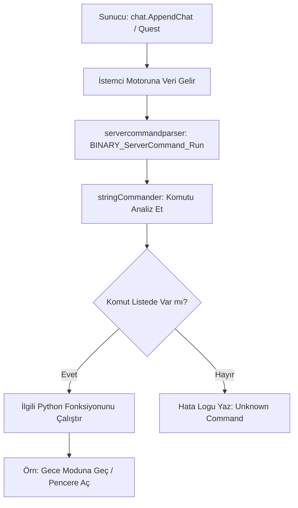

# 🎓 Metin2 Skills: `servercommandparser.py` (Sunucu Komut Ayrıştırıcısı)

`servercommandparser.py`, sunucudan (Server) gelen özel emirleri alan ve bu emirlere göre istemci (Client) tarafında işlem yapan "Merkezi Haberleşme" birimidir.

---

## 🔍 Neleri Yönetir?

### 1. Sunucu Komut Listesi (`serverCommandList`)
Sunucunun gönderebileceği anahtar kelimeleri ve bu kelimeler geldiğinde hangi fonksiyonun çalışacağını belirler.
- **Örnekler:** 
    - `DayMode`: Oyunun gündüz veya gece olmasını tetikler.
    - `xmas_snow`: Karların yağmasını sağlar.
    - `item_mall`: Nesne Market penceresini açar.

### 2. Komut Analizi (`stringCommander`)
Sunucudan gelen karmaşık metin satırlarını (örn: `DayMode dark`) parçalarına ayırır ve içindeki parametreleri (`dark`) ilgili fonksiyona iletir.

### 3. Komut Kaydetme (`__PreserveCommand`)
Bazı komutların sadece bir kez değil, harita değiştirilse bile hatırlanması ve uygulanması için onları sisteme kaydeder.

---

## 🛠️ Modifikasyon ve Kritik Uyarılar

### ✅ Sunucudan Arayüz Açtırmak:
Sunucudaki bir görev (Quest) üzerinden oyuncunun ekranına yeni bir pencere (örn: Hediye Çarkı) getirmek istiyorsan, bu dosyaya yeni bir komut tanımı eklemelisin.

### ✅ Küresel Hava Durumu Kontrolü:
Sunucu genelinde bir etkinlik başladığında (örn: Ay Işığı Sandığı), tüm oyuncuların ekranında otomatik bir efekt çıkması veya müziğin değişmesi bu dosya üzerinden koordine edilebilir.

### ⚠️ Hatalı Komut Yapısı:
Eğer sunucudan gönderilen komutun parametre sayısı, bu dosyadaki fonksiyonun beklediği parametre sayısıyla eşleşmezse (örn: Sunucu 2 veri gönderiyor ama kod sadece 1 tane bekliyor), oyun çökebilir.

---

## 🚨 Hata Ayıklama (Debug)

**"Sunucu komutu gönderiyorum ama client tepki vermiyor" sorunu:**
1.  `BINARY_ServerCommand_Run` içindeki `print` satırını kontrol ederek gelen komutun client'a ulaşıp ulaşmadığını gör.
2.  `serverCommandList` içinde yazım hatası (Case Sensitivity) olup olmadığına bak.

---

## 📉 servercommandparser.py İşleyiş Akışı

---

**Sonuç:** `servercommandparser.py`, sunucunun istemci üzerindeki "Uzaktan Kumandasıdır". Oyun dünyasındaki dinamik değişikliklerin çoğunu bu dosya yönetir.
