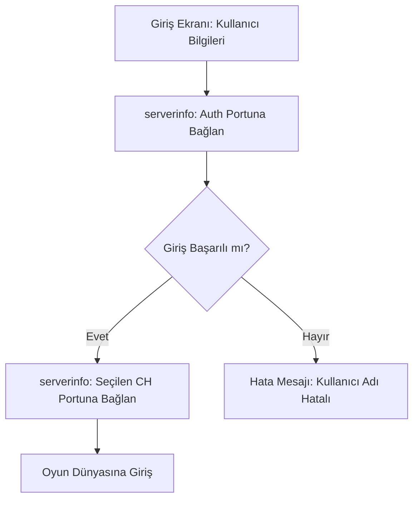

# 🎓 Metin2 Skills: `serverinfo.py` (Sunucu Bağlantı Bilgileri)

`serverinfo.py`, oyun istemcisinin hangi sunucuya, hangi IP adresi üzerinden ve hangi portlar aracılığıyla bağlanacağını belirleyen "Adres Defteridir".

---

## 🔍 Neleri Yönetir?

### 1. IP Adresi ve Portlar
Oyunun ana sunucusuna erişim için gerekli teknik verileri saklar:
- **`SERVER_IP`**: Sunucunun internet adresi.
- **`AUTH`**: Giriş yaparken kullanıcı adı ve şifrenin kontrol edildiği port.
- **`CH_1`, `CH_2`...**: Oyun dünyasına giriş yapılan kanalların portları.

### 2. Kanal Yapısı (`REGION_DICT`)
Sunucu listesinde kaç adet sunucu görüneceğini ve her sunucunun altında kaç adet kanal (CH) olacağını hiyerarşik olarak düzenler.

### 3. Sunucu Durumu (`STATE_DICT`)
Kanal listesinde sunucunun doluluk oranını gösteren metinleri yönetir:
- **NORM**: Normal.
- **BUSY**: Yoğun.
- **FULL**: Dolu.

### 4. Lonca İkonları (`MARKADDR_DICT`)
Lonca logolarının sunucudan çekilmesi için gerekli olan Mark Sunucusu adresini belirler.

---

## 🛠️ Modifikasyon ve Kritik Uyarılar

### ✅ Sunucu Değiştirme:
Eğer sunucunu başka bir makineye taşıdıysan veya yeni bir IP aldıysan, `SERVER_IP` ve port değerlerini buradan güncellemen gerekir.

### ✅ Yeni Kanal Ekleme:
`SERVER01_CHANNEL_DICT` içine yeni bir satır ekleyerek (Örn: CH5) oyunculara daha fazla kanal seçeneği sunabilirsin.

### ⚠️ IP Gizleme:
Eğer `SERVER_IP` kısmına doğrudan IP yazarsan, bu dosya kolayca okunabilir. Güvenlik için IP yerine bir domain adresi (Örn: `connect.metin2.com`) kullanmak daha profesyoneldir.

---

## 🚨 Hata Ayıklama (Debug)

**"Sunucuya bağlanırken hata" sorunu:**
1.  `SERVER_IP` adresinin doğruluğunu kontrol et.
2.  `AUTH` portunun sunucu tarafında açık (Firewall izinli) olduğundan emin ol.
3.  Dosya sonundaki `MARKADDR_DICT` içindeki ID değerinin sunucu `CONFIG` dosyalarıyla eşleştiğini doğrula.

---

## 📉 serverinfo.py Bağlantı Şeması

---

**Sonuç:** `serverinfo.py`, oyunun "Giriş Kapısıdır". Buradaki en ufak bir hata, hiçbir oyuncunun oyuna girememesine neden olur.
