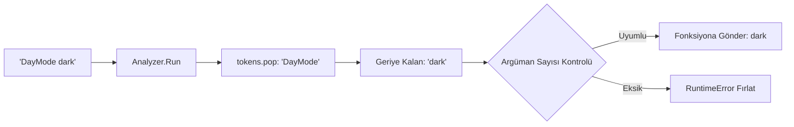

# 🎓 Metin2 Skills: `stringcommander.py` (Metin Tabanlı Komut İşleyici)

`stringcommander.py`, sunucudan gelen düz metin satırlarını anlamlı Python fonksiyon çağrılarına dönüştüren, `servercommandparser.py`'nin kalbinde yatan teknik altyapıdır.

---

## 🔍 Neleri Yönetir?

### 1. Dinamik Fonksiyon Analizi (`CallBackFunction`)
Bir fonksiyonun kaç tane parametre (Argüman) beklediğini otomatik olarak tespit eder. 
- **Örnek:** Eğer bir fonksiyon 2 veri bekliyorsa, gelen metinden sadece ilk 2 kelimeyi alır ve fonksiyona gönderir.

### 2. Zayıf Referans Yönetimi (`_weakref`)
Fonksiyonları ve nesneleri hafızada tutarken "Zayıf Referans" (Weak Reference) kullanır. Bu, oyunun hafıza kullanımını optimize eder ve gereksiz nesnelerin bellekten silinmesini (Garbage Collection) engellemez.

### 3. Hata Yakalama ve Doğrulama (`Analyzer.Run`)
Gelen komutun içindeki veri sayısı, fonksiyonun beklediği veri sayısından az ise sistem hata verir (`RuntimeError`). Bu, eksik veriyle fonksiyon çalıştırıp oyunu çökertmeyi önleyen bir güvenlik önlemidir.

---

## 🛠️ Modifikasyon ve Kritik Uyarılar

### ✅ Esnek Komut Yapısı:
Normalde bu sistem kelimeleri boşluklara göre ayırır (`split`). Eğer boşluk içeren bir cümle göndermek istiyorsan (örn: Bir duyuru metni), bu dosyada "greedy" (açgözlü) bir argüman mantığı geliştirmen gerekebilir.

### ✅ Güvenlik Kontrolleri:
Sunucudan gelen her metin satırı bu süzgeçten geçer. Buraya eklenecek bir "Log" mekanizması ile sunucudan hangi komutların ne sıklıkla geldiği takip edilebilir.

### ⚠️ Parametre Sayısı:
Bu dosya parametre sayısına karşı çok hassastır. Fonksiyon tanımındaki `self` dışındaki her değişken için sunucunun mutlaka bir veri göndermesi gerekir.

---

## 🚨 Hata Ayıklama (Debug)

**"curArgCount < needArgCount" Hatası:**
1.  Bu hata, sunucunun gönderdiği verinin eksik olduğunu söyler.
2.  Örn: Fonksiyon `def Test(self, a, b)` şeklindeyse ama sunucu sadece `Test 1` gönderiyorsa bu hata alınır. Çözüm için ya sunucudan veri eklenmeli ya da fonksiyondaki değişken sayısı azaltılmalıdır.

---

## 📉 stringcommander.py Ayrıştırma Şeması

---

**Sonuç:** `stringcommander.py`, oyunun "Dil Bilgisi" kurallarını belirleyen teknik bir temeldir. Sunucu ile İstemci arasındaki diyaloğun hatasız sürmesini sağlar.
