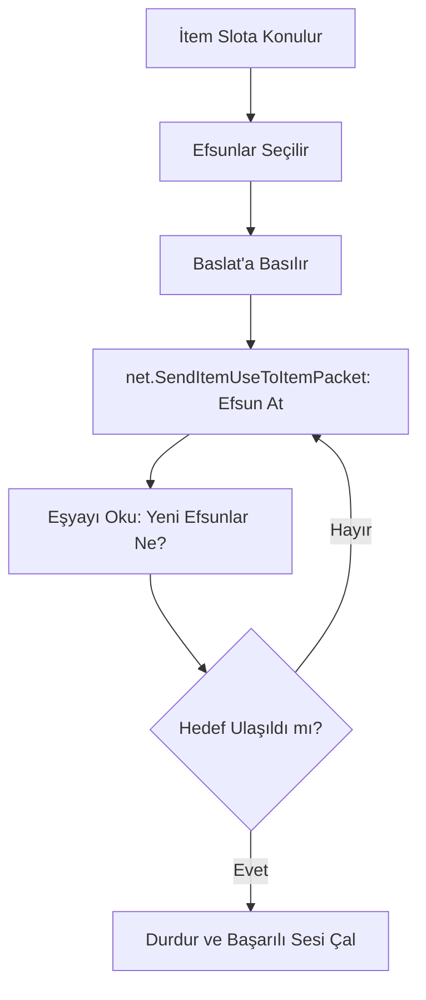

# 🎓 Metin2 Skills: `switchbot.py` (Otomatik Efsun Botu)

`switchbot.py`, oyuncuların eşyalarına istedikleri efsunları (Örn: Ortalama Zarar, Yarı İnsan) otomatik olarak getirmesini sağlayan, oyunun en popüler yardımcı sistemlerinden biridir.

---

## 🔍 Neleri Yönetir?

### 1. Otomatik Efsun Atma (`Switch`)
Sistem, envanterdeki "Efsun Nesnesi"ni (`SWITCH_VNUM = 71084`) alır ve hedeflenen eşyaya durmaksızın uygular. 
- **Hız Kontrolü:** `MIN_SWITCH_DELAY` ve `USER_SPEED_MULTIPLIER` ile efsun atma hızını belirleyerek sunucudan atılmayı (Kick) önler.

### 2. Bonus Kontrolü (`checkSwitch`)
Her efsun atışından sonra eşyanın yeni bonuslarını `player.GetItemAttribute` ile okur. Eğer oyuncunun seçtiği kriterlere (Örn: 10 Yarı İnsan) ulaşıldıysa işlemi durdurur ve oyuncuyu bilgilendirir.

### 3. Otomatik Satın Alma (`nachkauf`)
Eğer oyuncunun envanterindeki efsun nesnesi biterse ve NPC marketi açıksa, bot otomatik olarak marketten yeni efsun nesneleri satın alarak işleme devam eder.

### 4. Çoklu Slot Desteği (`MAX_NUM = 7`)
Aynı anda 5 veya 7 farklı eşyaya birden efsun atılabilmesini sağlayan sekmeli (Tab) bir yapı sunar.

---

## 🛠️ Modifikasyon ve Kritik Uyarılar

### ✅ Efsun Önerileri (Proposals):
Oyuncuların hangi iteme hangi efsunun geleceğini bilmemesi ihtimaline karşı, "Savaşçı Kılıcı İdeal Efsunları" gibi hazır şablonlar `proposals` sözlüğüne eklenebilir.

### ✅ 6/7. Efsun Desteği:
Standart efsunların yanı sıra, nadir bulunan 6. ve 7. efsunları da botun taraması için ilgili fonksiyonlar (`Switch_rare`) aktif edilebilir.

### ⚠️ Ban Riski:
Bu sistem, sunucu taraflı bir koruma yoksa çok hızlı çalışabilir. Ancak çok hızlı efsun atmak sunucuda "Log" bırakabilir veya oyuncunun banlanmasına neden olabilir.

---

## 🚨 Hata Ayıklama (Debug)

**"Bot efsun atıyor ama istediğim efsun gelince durmuyor" sorunu:**
1.  `BONI_AVAIL` listesinde ilgili efsunun ID'sinin doğru tanımlandığından emin ol.
2.  `checkSwitch` fonksiyonundaki yüzde hesaplamasını (`prob >= 90`) kontrol et.

---

## 📉 switchbot.py Çalışma Döngüsü

---

**Sonuç:** `switchbot.py`, modern Metin2 sunucularının "Vazgeçilmez Konforudur". Oyuncuyu binlerce kez tıklama zahmetinden kurtarır.
