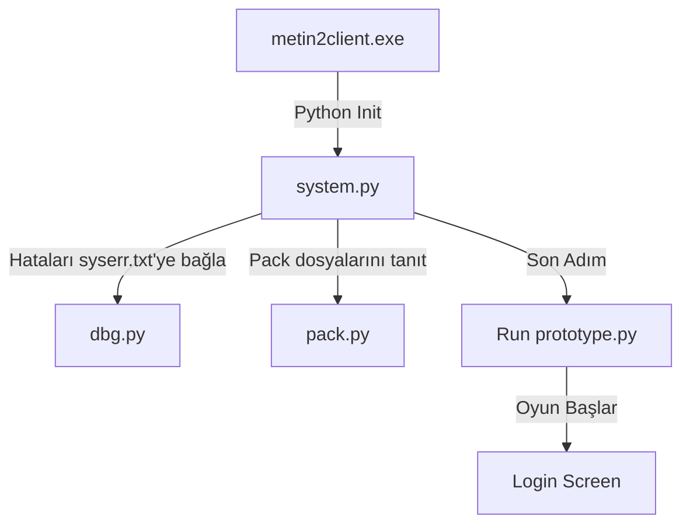

# 🎓 Metin2 Skills: `system.py` (Oyunun Sinir Sistemi)

`system.py`, Metin2'nin Python katmanının ilk nefesidir. Oyun dosyalarını paketlerden (Pack) okuma, hataları günlüğe yazma ve ilk ana dosyayı (`prototype.py`) başlatma görevini üstlenir.

---

## 🔍 Neleri Yönetir? (Fonksiyon Analizi)

### 1. Hata Yönlendirme (`TraceFile` & `TraceErrorFile`)
Oyun içinde bir hata oluştuğunda bu hatanın ekrana değil de `syserr.txt` dosyasına yazılmasını sağlayan yer burasıdır. 
- **Modifikasyon İpucu:** `sys.stderr = TraceErrorFile()` satırını kurcalarsan, hataları takip edemezsin ve oyun çöktüğünde nedenini asla bilemezsin.

### 2. Paket Okuma (`pack_file` & `__pack_import`)
Metin2'nin meşhur `.epk` ve `.eix` dosyalarından Python dosyalarını okumasını sağlar.
- **İşleyiş:** Sen bir dosyada `import ui` yazdığında, Python önce sistem kütüphanelerine bakmak yerine `system.py` aracılığıyla Pack (paket) dosyalarının içine bakar.

### 3. Ana Başlatıcı (`RunMainScript`)
Oyunun tüm logic işlemlerini başlatan fitili ateşler. Genellikle `prototype.py` dosyasını çağırır.

---

## 🛠️ Modifikasyon ve Kritik Uyarılar

### ⚠️ En Tehlikeli Değişiklik: `sys.path.append`
Dosyanın başında `sys.path.append("lib")` satırı bulunur. Eğer bu satırı silersen veya yolu değiştirirsen, oyun çalışmak için ihtiyaç duyduğu Python kütüphanelerini bulamaz ve **hiç açılmaz.**

### ✅ Lib Klasörüne Dosya Eklemek:
Eğer oyununa yeni bir harici kütüphane eklemek istiyorsan (örneğin gelişmiş matematik kütüphaneleri), bunları Pack içine atmak yerine oyunun ana dizinindeki `lib` klasörüne atabilirsin. `system.py` sayesinde orası otomatik olarak taranır.

---

## 🚨 Hata Ayıklama (Log Box)
`system.py` içinde `ShowException` adında bir fonksiyon vardır. Eğer oyun açılırken karşınıza bir hata kutusu (MsgBox) geliyorsa, o kutuyu tetikleyen yer burasıdır.

**Hata Almamak İçin:**
- Bu dosyada asla **Syntax hatası** yapmamalısın. Buradaki bir hata, hata loglama sistemini daha kurulmadan bozacağı için oyunun neden açılmadığını bile göremezsin.

---

## 📉 Oyunun Başlatılma Akış Şeması

---

**Sonuç:** `system.py`, oyunun altyapısını kuran "temel direk"tir. Buraya dokunurken iki kez düşünmelisin; çünkü buradaki bir hata tüm oyunu "sessizce" çökertebilir.
