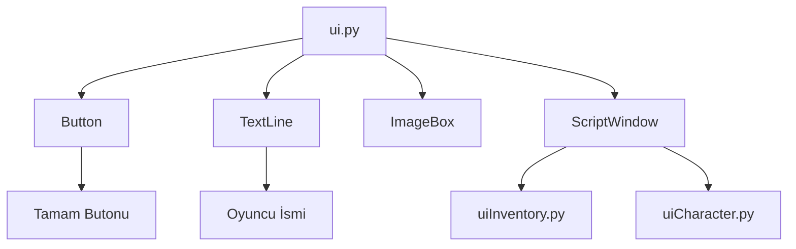

# 🎓 Metin2 Skills: `ui.py` (Arayüz Kütüphanesi)

`ui.py`, oyunun "Tuğla Fabrikası"dır. Gördüğün her buton, her metin kutusu ve her pencere buradaki temel sınıflardan üretilir. Metin2 UI sisteminin anayasasıdır.

---

## 🔍 Neleri Barındırır? (Temel Sınıflar)

### 1. `Window` (Temel Pencere)
Her şeyin atasıdır. Pozisyon (`SetPosition`), Boyut (`SetSize`) ve Görünürlük (`Show/Hide`) gibi temel özellikleri sağlar.

### 2. `Button` (Düğme)
Tıklanabilir öğelerdir. Üzerine gelme (`OverIn`), tıklama (`Down`) ve bırakma (`Up`) durumlarını yönetir.

### 3. `TextLine` (Yazı Satırı)
Ekranda metin göstermek için kullanılır. Yazı tipi (Font) ve renk ayarları buradan yapılır.

### 4. `ScriptWindow`
Dışarıdan `.py` (UIScript) dosyalarını yükleyebilen pencerelerdir. Karmaşık arayüzler (örn: Envanter) genellikle bu sınıfı kullanır.

---

## 🛠️ Modifikasyon ve Kritik Uyarılar

### ✅ Tüm Butonlara Ses Eklemek:
Eğer oyundaki her butona tıklandığında aynı sesin çıkmasını istiyorsan, `Button` sınıfı içindeki `CallEvent` veya `OnMouseLeftButtonDown` fonksiyonuna bir `snd.PlaySound` komutu ekleyebilirsin.

### ✅ Seçim Rengini Değiştirmek:
Dosyanın başında `SELECT_COLOR` adında bir değişken bulunur. Bunu değiştirerek, envanterde bir öğeyi seçtiğinde veya bir listede bir satıra tıkladığında çıkan mavi/sarı parlamanın rengini tüm oyunda değiştirebilirsin.

### ⚠️ Infinite Loop (Sonsuz Döngü) Riski:
`OnUpdate` veya `OnRender` fonksiyonları saniyede 60+ kez çalışır. Eğer bu fonksiyonların içine ağır işlemler veya hatalı döngüler yazarsan, oyunun FPS değeri 1'e düşer ve oyun donar.

---

## 🚨 Hata Ayıklama (Debug)

**"Pencere açılıyor ama içindeki butonlar çalışmıyor" sorunu:**
Bu genellikle `__mem_func__` yapısında bir hata olduğunda yaşanır. `ui.py` içindeki bu özel yapı, Python'un hafıza yönetimini kontrol eder. Eğer bir butona event (olay) atarken hata yaparsan, Python o fonksiyonu bulamaz.

---

## 📉 ui.py Mimari Yapısı

---

**Sonuç:** `ui.py` dosyasını anlamak, Metin2'de arayüz geliştirebilmenin (Frontend) ilk ve en önemli adımıdır. Buradaki her satır, binlerce farklı pencerede hayat bulur.
