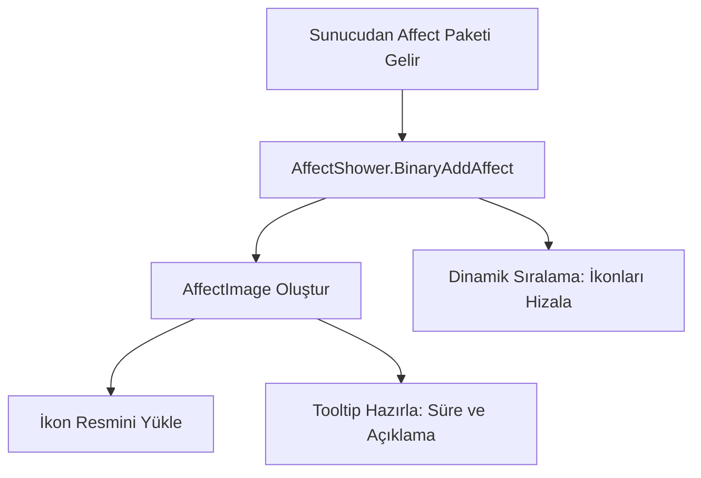

# 🎓 Metin2 Skills: `uiAffectShower.py` (Buff ve Durum İkonları)

`uiAffectShower.py`, ekranın sol üst köşesinde biriken şebnemler, ejderha tanrıları, lonca becerileri ve negatif etkilerin (sersemleme, zehir) ikonlarını yöneten dosyadır.

---

## 🔍 Neleri Yönetir?

### 1. Etki İkonları (`AffectImage`)
Her bir buff veya debuff için bir ikon oluşturur. İkonun üzerine gelindiğinde kalan süreyi ve ne işe yaradığını (`uiToolTip`) gösterir.

### 2. Evlilik ve At Durumu
- **Sevgi Puanı:** Evliysen çıkan kalbin doluluk oranını yönetir.
- **At Durumu:** Atın canını ve dayanıklılığını (yorgunluğunu) ikonlar üzerinden takip eder.

### 3. Dinamik Sıralama
Yeni bir buff aldığında veya birinin süresi bittiğinde ikonların kaymadan, düzgün bir şekilde yan yana dizilmesini sağlar.

---

## 🛠️ Modifikasyon ve Kritik Uyarılar

### ✅ Yeni Buff Eklemek:
Sunucuya yeni bir özellik (örn: "Battle Pass Buff") eklediğinde, bu özelliğin ikonunu göstermek için `AFFECT_DATA_DICT` içine ilgili ID'yi ve `.sub` dosya yolunu eklemelisin.

### ✅ Kalan Süreyi Gizlemek:
Süresiz (999 gün) olan bazı Nesne Market etkilerinin altındaki o kafa karıştırıcı süreyi gizlemek için `OnUpdate` fonksiyonunda bir kontrol ekleyebilirsin.

### ⚠️ İkon Çakışmaları:
Çok fazla buff basıldığında (örn: 20+ ikon) bunlar mini haritaya kadar taşabilir. Bu durumda ikonların boyutlarını küçültmek veya ikinci bir satır oluşturmak için `AffectShower` sınıfındaki yerleşim mantığını değiştirmelisin.

---

## 🚨 Hata Ayıklama (Debug)

**"Buff aldığımda ikon beyaz görünüyor" sorunu:**
1.  `AFFECT_DATA_DICT` içindeki dosya yolunu kontrol et. `.sub` veya `.tga` dosyası eksik veya yanlış dizinde olabilir.
2.  `syserr.txt` dosyasında "Failed to load image" hatası olup olmadığına bak.

---

## 📉 uiAffectShower.py Akış Şeması

---

**Sonuç:** `uiAffectShower.py`, oyuncunun o anki "Güç Seviyesini" görselleştiren bir panodur. Buradaki bilgilerin netliği, kritik anlarda strateji kurmayı kolaylaştırır.
