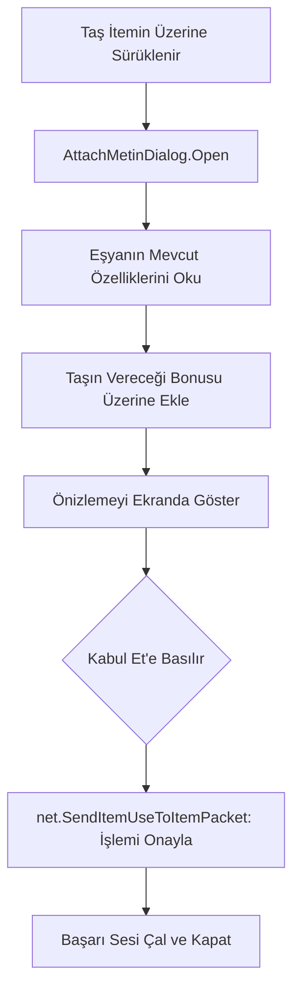

# 🎓 Metin2 Skills: `uiAttachMetin.py` (Taş Ekleme Paneli)

`uiAttachMetin.py`, bir zırha veya silaha Metin Taşı (Ruh Taşı) eklemek istediğinde açılan ve işlemin sonucunu önceden gösteren karşılaştırma panelini yönetir.

---

## 🔍 Neleri Yönetir?

### 1. Karşılaştırmalı Önizleme
Pencere yan yana iki adet bilgi kutusu (Tooltip) açar:
- **Sol Taraf (`oldToolTip`):** Eşyanın şu anki halini gösterir.
- **Sağ Taraf (`newToolTip`):** Taş eklendikten sonra eşyanın kazanacağı yeni özellikleri ve görünümü gösterir.

### 2. Uyumluluk Kontrolü (`CanAttachMetin`)
Taşın, eşya üzerindeki boş sokete uygun olup olmadığını denetler. (Örn: Gümüş sokete sadece belirli taşlar girebilir).

### 3. İşlem Onayı ve Ses Efekti
Oyuncu "Kabul" dediğinde sunucuya paketi gönderir ve başarılı bir taş ekleme sesi (`metinstone_insert.wav`) çalar.

---

## 🛠️ Modifikasyon ve Kritik Uyarılar

### ✅ Başarı Şansı Göstergesi:
Taş ekleme işlemi her zaman başarılı olmayabilir. Eğer sunucunda bir "Başarı Yüzdesi" varsa, bunu pencerenin orta kısmına bir yazı olarak ekleyebilirsin.

### ✅ Otomatik Soket Seçimi:
Eğer eşya üzerinde birden fazla boş soket varsa, taşın hangi sırayla yerleşeceğini belirleyen mantığı `Open` fonksiyonu içinde özelleştirebilirsin.

### ⚠️ Tooltip Genişliği:
`UpdateDialog` fonksiyonu, eşyanın özellik sayısına göre pencereyi genişletir. Eğer çok fazla efsunlu bir iteme bakılıyorsa pencere ekranın dışına taşabilir.

---

## 🚨 Hata Ayıklama (Debug)

**"Taşı sürüklüyorum ama karşılaştırma ekranı gelmiyor" sorunu:**
1.  `uiscript/attachstonedialog.py` dosyasının varlığını kontrol et.
2.  `CanAttachMetin` fonksiyonundaki soket tiplerinin (`METIN_SOCKET_TYPE_SILVER` vb.) sunucu verileriyle eşleştiğinden emin ol.

---

## 📉 uiAttachMetin.py Veri Akışı

---

**Sonuç:** `uiAttachMetin.py`, oyuncunun itemini güçlendirirken hata yapmasını önleyen bir "Önizleme Aynasıdır".
