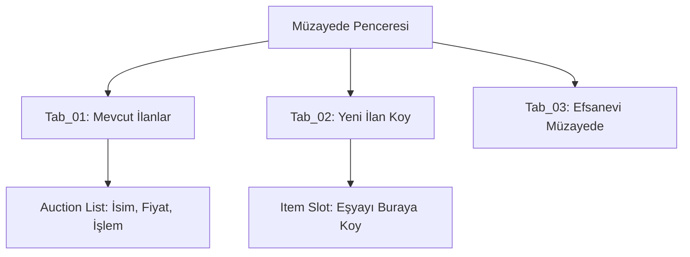

# 🎓 Metin2 Skills: `uiAuction.py` (Müzayede / Açık Artırma Sistemi)

`uiAuction.py`, oyuncuların eşyalarını açık artırma usulüyle satmalarını veya başkalarının koyduğu eşyalara teklif vermelerini sağlayan "Müzayede" sistemini yönetir.

---

## 🔍 Neleri Yönetir?

### 1. Müzayede Sekmeleri
Pencere üç ana bölümden oluşur:
- **Liste (LIST):** O an satışta olan tüm eşyaları ve fiyatlarını gösterir.
- **Kayıt (REGISTER):** Oyuncunun kendi eşyasını açık artırmaya çıkarmasını sağlar.
- **Özel Müzayede (UNIQUE_AUCTION):** Sadece çok nadir ve değerli eşyalar için ayrılmış özel alandır.

### 2. Sayfa Yönetimi (`PageWindow`)
Her bir sekme için ayrı tasarım dosyalarını (`uiscript/auctionwindow_...`) yükleyerek arayüzün düzenli kalmasını sağlar.

### 3. Dinamik Liste Oluşturma
Müzayedeye çıkan eşyalar için isim, fiyat ve işlem butonlarını otomatik olarak hizalar ve listeler.

---

## 🛠️ Modifikasyon ve Kritik Uyarılar

### ✅ Gerçek Zamanlı Teklif Verme:
Oyuncuların sayfayı kapatıp açmadan yeni teklifleri görebilmesi için `OnUpdate` içine küçük bir yenileme mantığı ve "Teklif Ver" butonu eklenebilir.

### ✅ Filtreleme ve Arama:
Müzayedede çok fazla eşya varsa, item tipine (Zırh, Silah) veya fiyat aralığına göre arama yapma özelliği buraya entegre edilebilir.

### ⚠️ Veri Senkronizasyonu:
Açık artırma sistemleri sunucuyla çok sık iletişim kurar. Eğer paket gönderimi (`net.Send...`) sırasında bir gecikme olursa, oyuncu "son saniye teklifi" verdiğini sanıp itemi kaybedebilir.

---

## 🚨 Hata Ayıklama (Debug)

**"Müzayede listesi boş görünüyor" sorunu:**
1.  Sunucu tarafında müzayede sisteminin aktif olup olmadığını kontrol et.
2.  `__MakeListPage` içindeki döngülerin (`xrange`) sunucudan gelen eşya sayısıyla eşleşip eşleşmediğine bak.

---

## 📉 uiAuction.py Yapı Şeması

---

**Sonuç:** `uiAuction.py`, oyun ekonomisinin "Borsasıdır". Değerli eşyaların gerçek piyasa değerini bulduğu en rekabetçi ticaret alanıdır.
