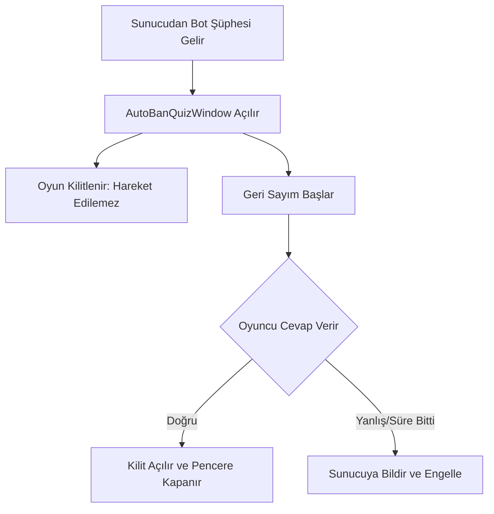

# 🎓 Metin2 Skills: `uiAutoBan.py` (Bot Kontrol / Quiz Sistemi)

`uiAutoBan.py`, oyundaki otomatik hile ve bot kullanımını engellemek için oyuncuya rastgele sorular soran "Anti-Bot" sistemini yönetir. Oyuncunun gerçek bir insan olup olmadığını test eder.

---

## 🔍 Neleri Yönetir?

### 1. Bot Kontrol Sorusu (`AutoBanQuizWindow`)
Ekranda aniden bir pencere açar ve oyuncuya bir soru ile 3 seçenek sunar. Soru genellikle basit bir matematik işlemi veya kelime oyunudur.

### 2. Geri Sayım ve Kısıtlama
- **Süre Sınırı:** Oyuncunun cevap vermesi için kısıtlı bir süresi (`duration`) vardır. Süre biterse veya yanlış cevap verilirse sistem otomatik işlem yapar (Ban veya DC).
- **Kilitleme (`Lock`):** Pencere açıkken oyuncunun hareket etmesini, saldırmasını veya pencereyi kapatmasını engeller.

### 3. Cevap Gönderimi
Oyuncu bir seçeneğe tıkladığında `net.SendChatPacket("/autoban_answer ...")` komutu ile cevabı sunucuya iletir.

---

## 🛠️ Modifikasyon ve Kritik Uyarılar

### ✅ Görsel Doğrulama (Captcha):
Sadece metin tabanlı sorular botlar tarafından kolayca okunabilir. Bu sistemi daha güvenli hale getirmek için resim tabanlı (Captcha) bir kontrol sistemi buraya entegre edilebilir.

### ✅ Yeni Soru Türleri:
Farklı dillerde veya farklı zorluk seviyelerinde sorular eklemek için sunucu tarafındaki scriptlerle uyumlu yeni veri okuma mantığı (`quiz.split("|")`) eklenebilir.

### ⚠️ Bypass (Atlatma) Riskleri:
`OnPressEscapeKey` fonksiyonu standart olarak engellenmiştir. Eğer oyuncu pencereyi kapatmanın bir yolunu bulursa (örn: karakter değiştirme), sistemin bunu tespit edip karakteri otomatik engellemesi gerekir.

---

## 🚨 Hata Ayıklama (Debug)

**"Soru ekranı geliyor ama butonlara basılmıyor" sorunu:**
1.  `Lock()` fonksiyonunun arayüzün diğer kısımlarına müdahale edip etmediğini kontrol et.
2.  `__Select` fonksiyonundaki `index` değerlerinin sunucudaki cevap anahtarıyla uyuştuğundan emin ol.

---

## 📉 uiAutoBan.py Akış Şeması

---

**Sonuç:** `uiAutoBan.py`, sunucu huzurunu koruyan "Dijital Güvenlik Görevlisidir". Hile kullanımını minimize etmek için tasarlanmıştır.
