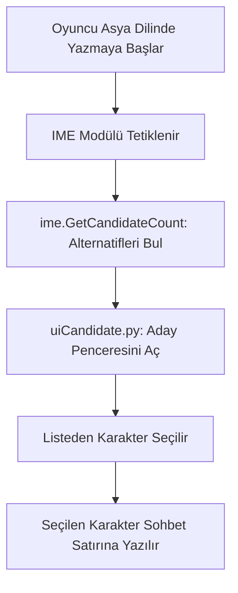

# 🎓 Metin2 Skills: `uiCandidate.py` (Giriş Metodu Aday Listesi / IME)

`uiCandidate.py`, ismi "Aday" (Candidate) olsa da aslında bir seçim sistemi değil, Uzak Doğu dillerindeki (Korece, Japonca, Çince) özel karakter giriş sistemini (IME - Input Method Editor) yöneten bir yardımcı dosyadır.

---

## 🔍 Neleri Yönetir?

### 1. Karakter Seçim Listesi (`CandidateListBox`)
Asya dillerinde bir kelime yazıldığında, o sesin karşılığı olan birden fazla sembol arasından seçim yapılması gerekir. Bu dosya, o sembollerin (Kanji, Hanja vb.) listelendiği kutucuğu yönetir.

### 2. Dil Sayfası Desteği (`CodePages`)
Korece (949), Japonca (932) ve Çince (936, 950) dilleri için farklı pencere sınıflarını (`KORCandidateWindow` veya `VerticalCandidateBoard`) sisteme kaydeder.

### 3. Dinamik Pozisyonlama
Oyuncu sohbet satırına bir şeyler yazarken, aday listesi kutucuğunun imlecin hemen üzerinde veya yanında belirleyerek yazım sürecini kolaylaştırır.

---

## 🛠️ Modifikasyon ve Kritik Uyarılar

### ✅ Arayüz Teması Uyumluluğu:
Eğer sunucun Asya dillerini destekliyorsa, bu kutucukların tasarımını (`d:/ymir work/ui/pattern/ime/`) değiştirerek oyunun genel karanlık veya aydınlık temasına uydurabilirsin.

### ✅ Gereksiz Kod Temizliği:
Eğer sunucun sadece Türkçe veya İngilizce gibi Latin alfabelerini destekliyorsa, bu dosya teknik olarak neredeyse hiç çalışmaz. Ancak altyapı olarak `ui.py` içindeki `ime` modülüne bağlıdır, bu yüzden tamamen silinmesi hatalara yol açabilir.

### ⚠️ IME Kilitlenmeleri:
Yanlış bir `CandidateWindow` kaydı, bazı bilgisayarlarda dil paketi yüklü değilse klavyenin tamamen kilitlenmesine veya oyunun çökmesine neden olabilir.

---

## 🚨 Hata Ayıklama (Debug)

**"Yazı yazarken ekranın ortasında garip bir boş kutu çıkıyor" sorunu:**
1.  Bu durum genellikle `uiCandidate.py` içindeki bir sınıfın, sistemde olmayan bir resmi yüklemeye çalışmasıyla oluşur.
2.  `d:/ymir work/ui/pattern/ime/` klasöründeki `.tga` dosyalarının varlığını kontrol et.

---

## 📉 uiCandidate.py Çalışma Mantığı

---

**Sonuç:** `uiCandidate.py`, Metin2'nin küresel bir oyun olarak Asya pazarındaki yazım ihtiyaçlarını karşılayan teknik bir köprüdür.
