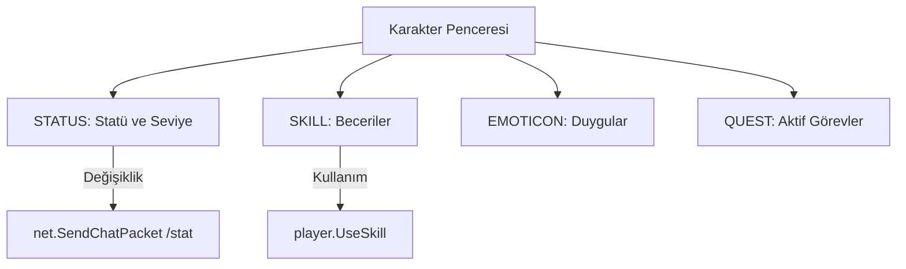

# 🎓 Metin2 Skills: `uiCharacter.py` (Karakter Bilgileri)

`uiCharacter.py`, oyuncunun gücünü, yeteneklerini (Skill) ve görevlerini takip ettiği "Karakter Kartı"nın beynidir.

---

## 🔍 Neleri Yönetir?

### 1. Statü Puanları (STR, DEX, INT, CON)
Karakter seviye atladığında kazandığı statü puanlarını dağıtmasını sağlar.
- **İpucu:** `statusPlusCommandDict` kısmında görüldüğü gibi, "+" butonuna bastığında oyun aslında arkada `/stat str` gibi bir komut çalıştırır.

### 2. Yetenek (Skill) Gelişimi
Yeteneklerin seviyesini (1-20), Master (M), Grand (G) ve Perfect (P) durumlarını görselleştirir.
- **Özellik:** `app.ENABLE_10_STATU` ayarı aktifse, CTRL tuşuna basarak statülere 10'ar 10'ar puan verebilirsin.

### 3. Duygu ve Hareketler (Emotions)
Dans etme, selamlama veya başka bir oyuncuyla yapılan (Öpücük, Tokalaşma) hareketlerin listesini ve kullanımını yönetir.

---

## 🛠️ Modifikasyon ve Kritik Uyarılar

### ✅ Yeni Statüler Eklemek:
Eğer sunucunda "Zeka" veya "Güç" dışında yeni bir statü (örn: "Şans") varsa, bu dosyada hem `RefreshStatus` fonksiyonuna hem de `UIScript` tarafına ekleme yapmalısın.

### ✅ Hızlı Statü Verme:
Eğer oyuncuların her seferinde 1 puan vermesinden sıkıldıysan, `__OnClickStatusPlusButton` fonksiyonundaki paket gönderme kısmını `1` yerine `5` veya `10` yaparak tek tıkla daha fazla puan verilmesini sağlayabilirsin.

### ⚠️ Skill Puanı Hataları:
`RefreshSkill` fonksiyonunda bir hata yaparsan, oyuncu skill puanı verse bile becerileri yükselmeyebilir veya puanları boşa gidebilir.

---

## 🚨 Hata Ayıklama (Debug)

**"Statü veriyorum ama işlemiyor" veya "Karakter penceresi boş görünüyor" sorunu:**
1.  `player.GetStatus` fonksiyonlarının doğru değer döndürüp döndürmediğine bak.
2.  `CharacterWindow.py` (UIScript) dosyasındaki nesne isimlerinin (`Level_Value`, `HP_Value` vb.) `uiCharacter.py` içindeki isimlerle tam uyuştuğundan emin ol.

---

## 📉 uiCharacter.py Sekme Yapısı

---

**Sonuç:** `uiCharacter.py`, oyuncunun gelişimini temsil eden en önemli dosyadır. Buradaki düzenlemeler, karakter gelişim hızını ve kullanıcı deneyimini (UX) doğrudan etkiler.
