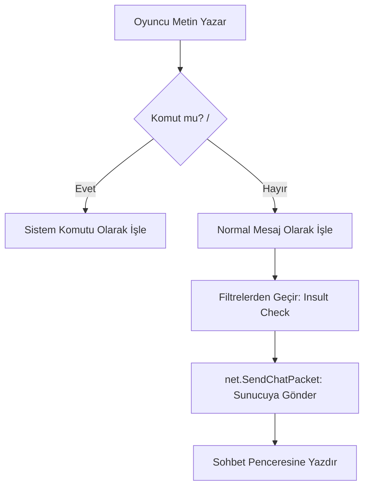

# 🎓 Metin2 Skills: `uiChat.py` (Sohbet Sistemi)

`uiChat.py`, oyuncuların birbirleriyle iletişim kurduğu, sistem duyurularını aldığı ve oyun içi komutları (slash commands) yazdığı merkezdir.

---

## 🔍 Neleri Yönetir?

### 1. Sohbet Modları (Genel, Grup, Lonca, Bağırma)
Oyuncunun hangi kanaldan yazdığını ve bu yazıların hangi renkte (`colorInfo.py` referanslı) görüneceğini belirler.

### 2. Sohbet Komutları (`ENABLE_CHAT_COMMAND`)
Oyuna `/warp`, `/dice`, `/quit` gibi komutlar yazıldığında, bu komutların işlenip işlenmeyeceğine karar verir.

### 3. Yazı Geçmişi (Stack)
Yukarı/Aşağı ok tuşlarına basarak daha önce yazdığın mesajları tekrar getirmeyi sağlar (`ENABLE_LAST_SENTENCE_STACK`).

---

## 🛠️ Modifikasyon ve Kritik Uyarılar

### ✅ Yeni Bir Komut Eklemek:
Eğer oyuncuların `/discord` yazdığında bir link görmesini veya bir işlem yapmasını istiyorsan, komut yakalama fonksiyonuna yeni bir blok eklemelisin.
- **İpucu:** `OnIMEReturn` fonksiyonu mesajın gönderildiği andır. Burada mesajın başına bakarak kendi özel komutlarını yaratabilirsin.

### ✅ Küfür Filtresini Kapatmak:
`ENABLE_INSULT_CHECK = True` satırını `False` yaparak oyunun içindeki otomatik sansür sistemini devre dışı bırakabilirsin.

### ⚠️ Sohbet Penceresinin Kilitlenmesi:
Eğer `OnUpdate` fonksiyonunda çok fazla metin tarama işlemi yaparsan, birisi çok hızlı yazdığında (Spam) oyunun kasmasına veya donmasına sebep olabilirsin.

---

## 🚨 Hata Ayıklama (Debug)

**"Yazdıklarım gitmiyor" veya "Yazı yazamıyorum" sorunu:**
1.  `ime.py` (Input Method Editor) bağlantısını kontrol et.
2.  `uiChat.py` içinde `net.SendChatPacket` fonksiyonunun çalışıp çalışmadığına bak. Eğer paket gönderilemiyorsa sunucuyla olan senkronizasyon bozulmuş olabilir.

---

## 📉 uiChat.py İletişim Şeması

---

**Sonuç:** `uiChat.py`, oyunun sosyal dokusudur. Buradaki geliştirmeler (örn: Global bağırma, emoji sistemi) oyuncular arasındaki etkileşimi doğrudan artırır.
