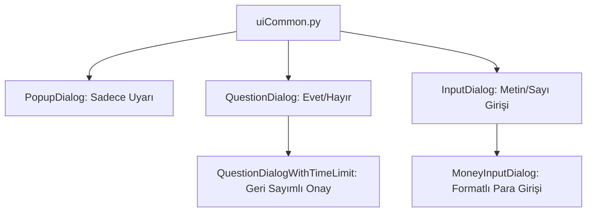

# 🎓 Metin2 Skills: `uiCommon.py` (Ortak Diyalog Kütüphanesi)

`uiCommon.py`, oyunun her yerinde kullanılan "Kayıt etmek istiyor musun?", "İsim giriniz", "Hata: Bağlantı koptu" gibi standart pencerelerin şablonlarını içerir.

---

## 🔍 Neleri Yönetir?

### 1. Uyarı Pencereleri (`PopupDialog`)
Sadece bilgi vermek için kullanılır. Ortasında bir mesaj ve altında bir "Tamam" butonu bulunur.

### 2. Giriş Pencereleri (`InputDialog`)
Oyuncudan yazı veya sayı girmesini bekler. Karakter ismi değiştirme, şifre girme veya miktar belirleme gibi yerlerde kullanılır.
- **Gizli Mod:** `SetSecretMode` ile yazılanların yıldız (*) şeklinde görünmesini sağlar.

### 3. Onay Pencereleri (`QuestionDialog`)
"Evet/Hayır" seçenekleri sunar. Bir itemi silerken veya bir gruba girerken çıkan o meşhur onay kutusudur.
- **Süreli Onay:** `QuestionDialogWithTimeLimit` ile ekranda geri sayım yaparak (örn: 10 saniye içinde kabul etmezsen iptal olur) işlem yapar.

### 4. Para Giriş Penceresi (`MoneyInputDialog`)
Sayı girerken aynı zamanda yan tarafta bunun "1.000.000 Yang" şeklinde formatlanmış halini göstererek oyuncunun hata yapmasını önler.

---

## 🛠️ Modifikasyon ve Kritik Uyarılar

### ✅ Tüm Pencerelerin Tasarımını Değiştirmek:
Eğer oyunun tüm uyarı pencerelerini daha modern veya farklı renkte bir çerçeveyle (`Board`) göstermek istiyorsan, bu dosyadaki sınıfların `__LoadDialog` kısımlarını düzenleyerek tek bir yerden tüm oyunu değiştirebilirsin.

### ✅ Maksimum Sayı Sınırı:
`MoneyInputDialog` içinde standart olarak 9 hane (999.999.999) sınırı olabilir. Eğer sunucunda 2 Milyar (2T) üzerinde ticaret varsa bu sınırı buradaki `SetMaxLength` kısmından artırmalısın.

### ⚠️ Boş Giriş Kontrolü:
`InputDialog` kullanırken oyuncunun hiçbir şey yazmadan "Tamam"a basması bazı sistemlerde hataya yol açabilir. Bu yüzden her zaman `GetText()` boş mu diye kontrol edilmelidir.

---

## 🚨 Hata Ayıklama (Debug)

**"Onay kutusunda 'Evet'e basıyorum ama hiçbir şey olmuyor" sorunu:**
1.  `SetAcceptEvent` ile bağladığın fonksiyonun ismini ve parametrelerini kontrol et.
2.  Eğer fonksiyon içinde bir hata (Syntax Error) varsa pencere kapanır ama işlem yapılmaz.

---

## 📉 uiCommon.py Hiyerarşi Şeması

---

**Sonuç:** `uiCommon.py`, oyunun "Sorular ve Cevaplar" kütüphanesidir. Buradaki her bir sınıf, oyunun farklı yerlerinde yüzlerce kez tekrar kullanılır.
