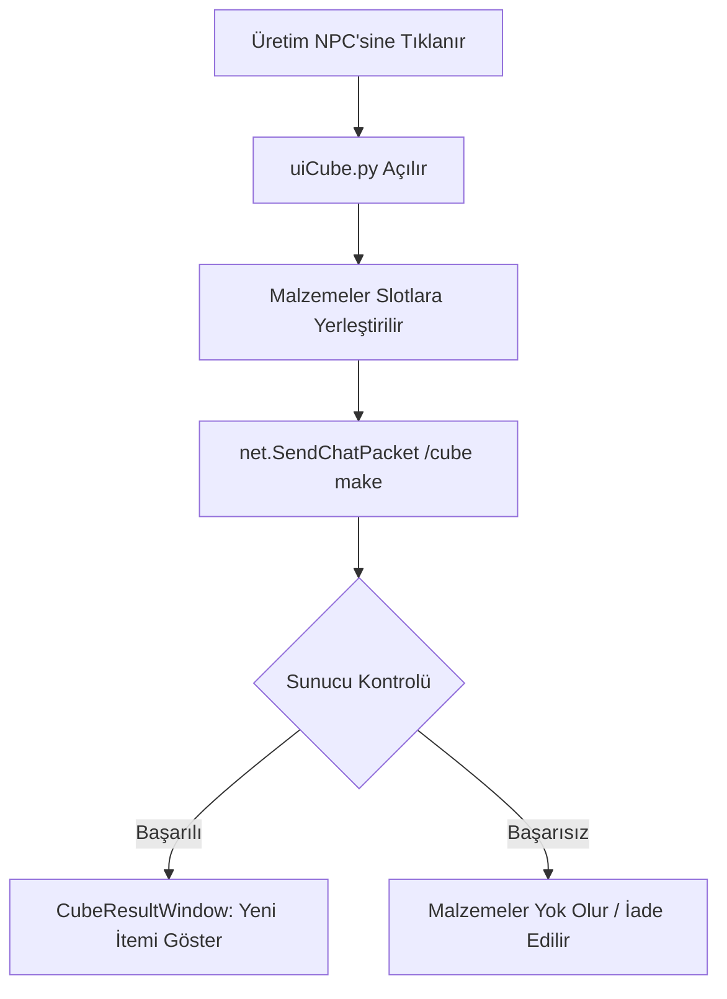

# 🎓 Metin2 Skills: `uiCube.py` (Eşya Üretim / Craft Sistemi)

`uiCube.py`, oyundaki "Arındırma Paneli" veya "Craft Sistemi" olarak bilinen, malzemeleri birleştirerek yeni eşyalar (iksirler, epik silahlar vb.) üretmeni sağlayan sistemi yönetir.

---

## 🔍 Neleri Yönetir?

### 1. Üretim Paneli (`CubeWindow`)
Eşyaları sürükleyip bıraktığın ana penceredir. Hangi malzemeden kaç tane koyduğunu takip eder.

### 2. Sonuç Penceresi (`CubeResultWindow`)
Üretim başarılı olduğunda veya başarısız olduğunda ekrana gelen, çıkan eşyayı gösteren küçük bilgi penceresüdür.

### 3. Reçete Kontrolü
Sunucuya "Elimde bu malzemeler var, bunlarla ne üretebilirim?" diye sormak yerine, sunucudan gelen reçete verilerini oyuncuya gösterir.

---

## 🛠️ Modifikasyon ve Kritik Uyarılar

### ✅ Üretim Listesi Eklemek:
Normalde Metin2'nin standart craft sistemi "gizlidir" (neyi koyarsan o çıkar). Ancak oyuncuların hangi eşyaları üretebileceğini bir liste halinde görmesi için bu dosyaya bir `ListBox` veya sekmeli bir menü eklenebilir.

### ✅ Toplu Üretim (Craft All):
Tek tek iksir üretmek yerine, envanterdeki tüm malzemeleri kullanarak tek tıkla 200 adet iksir üretilmesini sağlayacak bir buton buraya eklenebilir.

### ⚠️ Yanlış Nesne Gönderimi:
Eğer `CubeWindow` üzerinden gönderilen slot numaraları (`SlotIndex`) hatalıysa, oyuncu değerli bir kılıcı "iksir malzemesi" sanıp sisteme verebilir ve itemi kaybedebilir. Bu yüzden sürükle-bırak kontrolü çok hassastır.

---

## 🚨 Hata Ayıklama (Debug)

**"Malzemeleri koyuyorum ama 'Üret' butonu yanmıyor" sorunu:**
1.  `net.SendChatPacket("/cube ...")` komutunun sunucuya gidip gitmediğini kontrol et.
2.  `CubeWindow.py` (UIScript) içindeki slot sayısının sunucudaki maksimum malzeme sayısıyla uyumlu olduğundan emin ol.

---

## 📉 uiCube.py Üretim Döngüsü

---

**Sonuç:** `uiCube.py`, oyunun "Simyacısı" veya "Demircisidir". Oyuncuların ham maddeleri değerli eşyalara dönüştürdüğü ekonomik bir köprüdür.
