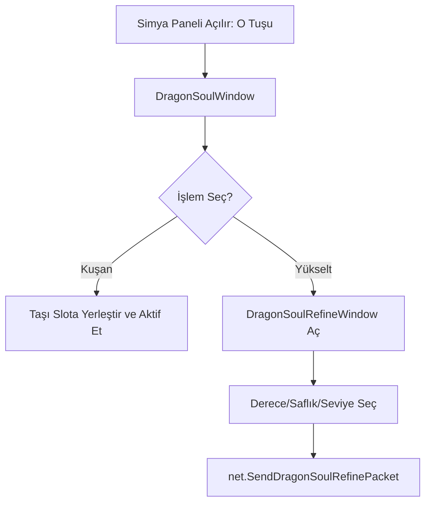

# 🎓 Metin2 Skills: `uiDragonSoul.py` (Ejderha Taşı Simyası)

`uiDragonSoul.py`, oyundaki en karmaşık güçlendirme sistemi olan "Simya" (Dragon Soul Refine) sisteminin beynidir. Ejderha taşlarının envanterini, kuşatılmasını ve yükseltilmesini yönetir.

---

## 🔍 Neleri Yönetir?

### 1. Simya Envanteri ve Paneli
Ejderha taşları normal envanterde değil, buradaki özel 5 sekmeli (Elmas, Yakut, Yeşim, Safir, Grenat, Oniks) envanterde tutulur.
- **Kuşanma:** Taşları paneldeki ilgili slotlara yerleştirmeyi ve "Aktif Et" butonu ile bonusları devreye sokmayı sağlar.

### 2. Yükseltme Sistemi (`DragonSoulRefineWindow`)
Taşların derecesini (Ham, Yontulmuş, Nadir vb.), saflığını ve seviyesini artırmak için kullanılan geliştirme arayüzüdür.
- **Birleştirme:** Aynı türden birden fazla taşı bir araya getirerek bir üst seviyeye deneme yapma mantığını yönetir.

### 3. Deck (Set) Yönetimi
Oyuncuların iki farklı simya seti (Deck 1 ve Deck 2) kurabilmesini ve bunlar arasında geçiş yapabilmesini sağlar.

---

## 🛠️ Modifikasyon ve Kritik Uyarılar

### ✅ Yeni Taş Türleri Ekleme:
Eğer oyuna 7. veya 8. bir simya taşı eklemek istiyorsan, hem `KIND_TAP_TITLES` listesini hem de `inventoryTab` yapılandırmasını bu dosya üzerinden genişletmelisin.

### ✅ Simya Panelini Güzelleştirmek:
Simya arayüzü genellikle çok kalabalıktır. İkonların yerleşimini ve sekmelerin isimlerini bu dosyadaki `__LoadWindow` fonksiyonundan düzenleyerek daha kullanıcı dostu bir panel yaratabilirsin.

### ⚠️ Aktivasyon Hatası:
Simya seti aktifken (ışık yanıyorken) taşların süresi azalır. Eğer `isActivated` değişkeni yanlış yönetilirse, oyuncu simyayı kapattığını sanırken taşlarının süresi bitmeye devam edebilir.

---

## 🚨 Hata Ayıklama (Debug)

**"Taşları koyuyorum ama 'Arındır' butonu aktif olmuyor" sorunu:**
1.  `RefineWindow` içindeki `SelectEmptySlot` ve `SelectItemSlot` fonksiyonlarını incele. 
2.  Eğer taşların VNUM (kod) aralığı sunucuyla uyuşmuyorsa, sistem bu eşyaları simya taşı olarak tanımayabilir.

---

## 📉 uiDragonSoul.py İşlem Akışı

---

**Sonuç:** `uiDragonSoul.py`, ileri seviye oyuncuların en çok vakit geçirdiği ve karakterlerini uç noktaya taşıdığı "Laboratuvardır".
