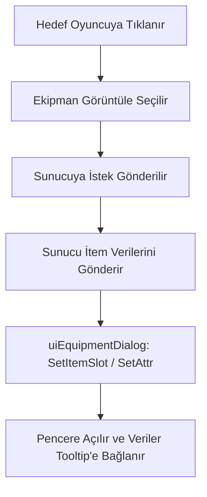

# 🎓 Metin2 Skills: `uiEquipmentDialog.py` (Ekipman Görüntüleme Sistemi)

`uiEquipmentDialog.py`, başka bir oyuncunun üzerindeki eşyaları (Zırh, Silah, Takılar vb.) görmeni sağlayan "Ekipman Görüntüleme" penceresini yönetir.

---

## 🔍 Neleri Yönetir?

### 1. Ekipman Listeleme
Hedef oyuncunun giydiği tüm eşyaları kendi envanterine benzer bir slot yapısında gösterir.
- **Dinamik İsim:** Pencerenin başlığında o an hangi oyuncuya bakıyorsan onun ismini yazar (`chr.GetNameByVID`).

### 2. Eşya Detayları (Sockets ve Attr)
Sadece eşyanın kendisini değil, üzerindeki taşları (`MetinSlot`) ve efsunları (`AttrSlot`) da sunucudan çekerek oyuncuya gösterir.
- **Tooltip Entegrasyonu:** Fareyle bir eşyanın üzerine gelindiğinde, o eşyanın tüm bonuslarını detaylıca görebilmeni sağlar.

---

## 🛠️ Modifikasyon ve Kritik Uyarılar

### ✅ Kostüm ve Kuşak Desteği:
Standart ekipman penceresi sadece ana itemleri gösterir. Eğer sunucunda Kostüm, Saç Stili veya Kuşak sistemi varsa, bu dosyadaki slot sayılarını ve yerleşimini (`UIScript` ile birlikte) genişletmelisin.

### ✅ Gizlilik Ayarı:
Oyuncuların kendi ekipmanlarını başkalarına kapatabilmesi için `uiGameOption.py` ile bağlantılı bir kontrol eklenebilir. Eğer oyuncu ekipmanını gizlediyse, bu pencerenin açılması engellenir.

### ⚠️ Efsun Senkronizasyonu:
Eğer sunucu tarafından gönderilen efsun verisi (`SetEquipmentDialogAttr`) eksik veya hatalı gelirse, oyuncu itemi "efsunsuz" veya "farklı efsunlu" görebilir. Bu durum ticaret ve rekabet açısından risklidir.

---

## 🚨 Hata Ayıklama (Debug)

**"Oyuncuya bakıyorum ama itemler boş görünüyor" sorunu:**
1.  `SetEquipmentDialogItem` fonksiyonunun sunucudan gelen paketle tetiklendiğinden emin ol.
2.  `vid` (Görsel Kimlik) değerinin doğru alınıp alınmadığını kontrol et. Eğer oyuncu menzilden çıkarsa bilgiler silinir.

---

## 📉 uiEquipmentDialog.py Veri Akışı

---

**Sonuç:** `uiEquipmentDialog.py`, oyuncular arasındaki "Rekabet ve Şeffaflık" aracıdır. Diğer oyuncuların nasıl güçlendiğini anlamanın en hızlı yoludur.
