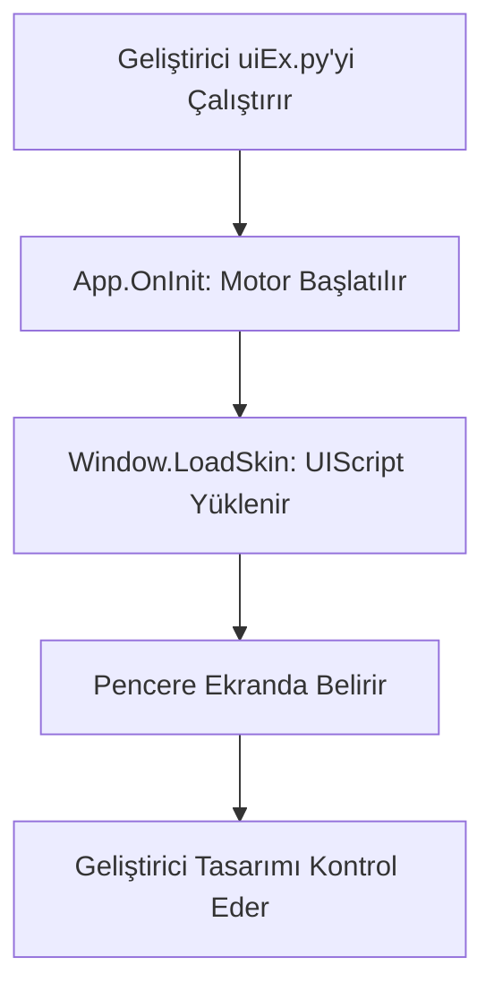

# 🎓 Metin2 Skills: `uiEx.py` (Gelişmiş Arayüz Yardımcısı ve Test Modülü)

`uiEx.py`, oyunun geliştirilme aşamasında kullanılan, yeni arayüz pencerelerini (UIScript) oyuna girmeden test etmeye yarayan bir yardımcı modüldür.

---

## 🔍 Neleri Yönetir?

### 1. İzole UI Testleri (`App` Sınıfı)
Oyunu tamamen başlatmadan, sadece arayüz motorunu (`wndMgr`) ayağa kaldırır. Bu sayede bir tasarımcı, hazırladığı `.py` dosyasını saniyeler içinde görebilir.

### 2. Gelişmiş Pencere Mantığı (`Window` Sınıfı)
Standart `ui.Window` sınıfına ek olarak, alt bileşenlerin (Child) daha kolay yönetilmesini ve sözlük (`childDict`) içinde saklanmasını sağlar.

### 3. Hata Ayıklama Modu
`wndMgr.SetOutlineFlag(True)` komutu ile ekrandaki tüm butonların, resimlerin ve yazıların kapladığı alanları (çerçevelerini) görmenizi sağlayarak yerleşim hatalarını bulmanıza yardımcı olur.

---

## 🛠️ Modifikasyon ve Kritik Uyarılar

### ✅ Hızlı Prototipleme:
Yeni bir sistem (örn: Switchbot) tasarlarken, kodun geri kalanını bozmadan sadece arayüzün nasıl göründüğüne bakmak için bu dosyayı bir "Test Bed" olarak kullanabilirsin.

### ✅ Özel Script Yükleyici:
`__LoadSkin` fonksiyonu, bir pencerenin dış görünümünü (UIScript) dinamik olarak değiştirmek için kullanılabilir.

### ⚠️ Üretim Ortamı (Production):
Bu dosya genellikle canlı sunucularda aktif olarak kullanılmaz. Dosyanın `if __name__ == "__main__":` bloğu, sadece dosya doğrudan çalıştırıldığında devreye girer.

---

## 🚨 Hata Ayıklama (Debug)

**"Arayüzün sınırlarını göremiyorum" sorunu:**
1.  `uiEx.py` içindeki `wndMgr.SetOutlineFlag(True)` satırının başındaki yorum işaretini (#) kaldırıp dosyayı çalıştırdığında, tüm kutucukların etrafında mavi/yeşil çizgiler belirecektir.

---

## 📉 uiEx.py Çalışma Yapısı

---

**Sonuç:** `uiEx.py`, Metin2 tasarımcılarının "Kum Havuzudur". Hataları erkenden bulup oyun içindeki arayüzün kusursuz olmasını sağlar.
