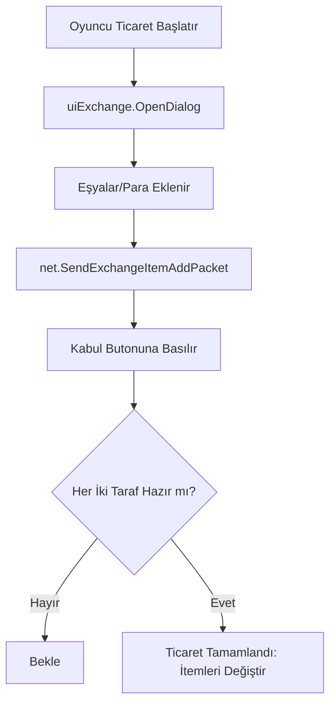

# 🎓 Metin2 Skills: `uiExchange.py` (Oyuncular Arası Ticaret)

`uiExchange.py`, iki oyuncunun birbirleriyle güvenli bir şekilde eşya ve para (Yang) takas etmesini sağlayan ticaret penceresini yönetir.

---

## 🔍 Neleri Yönetir?

### 1. Karşılıklı Eşya Slotları (`OwnerSlot` ve `TargetSlot`)
Senin koyduğun eşyalar ve karşı tarafın koyduğu eşyalar ayrı ayrı gösterilir.
- **İşleyiş:** Bir eşyayı sürüklediğinde `net.SendExchangeItemAddPacket` ile sunucuya bildirilir.

### 2. Kabul Sistemi (Accept)
Her iki oyuncu da "Kabul" butonuna basmadan ticaret gerçekleşmez.
- **Işıklar:** `OwnerAcceptLight` ve `TargetAcceptLight`, kimin hazır olduğunu görsel olarak belirtir.

### 3. Para Transferi (`dlgPickMoney`)
Ticarette ne kadar Yang verileceğini belirleyen küçük bir giriş penceresi açar.

---

## 🛠️ Modifikasyon ve Kritik Uyarılar

### ✅ Ticaret Güvenliğini Artırmak:
Dolandırıcılıkları önlemek için, karşı taraf bir itemi değiştirdiğinde veya yeni bir item eklediğinde "Kabul" butonunun otomatik olarak sıfırlanması (Un-accept) mantığı burada kurulur.

### ✅ Slot Sayısını Artırmak:
Standart 12 slotluk ticaret alanını 24'e veya daha fazlasına çıkarmak için `EXCHANGE_ITEM_MAX_NUM` değerini (genelde `exchange` modülünde tanımlıdır) ve bu dosyadaki döngüleri güncellemelisin.

### ⚠️ Mesafe Sınırı:
`USE_EXCHANGE_LIMIT_RANGE = 1000`. Eğer oyuncular takas sırasında birbirlerinden uzaklaşırlarsa, ticaret paketi (`net.SendExchangeExitPacket`) gönderilir ve pencere kapanır. Bu, "uzaktan ticaret" hilelerini önlemek içindir.

---

## 🚨 Hata Ayıklama (Debug)

**"Ticaret yaparken itemim kayboldu" veya "Ticaret penceresi kapanmıyor" sorunu:**
1.  `net.SendExchangeAcceptPacket` fonksiyonunun her iki taraftan da onay alıp almadığına bak.
2.  İtemin `ANTIFLAG_GIVE` (Takas edilemez) bayrağının olup olmadığını `uiExchange.py` içindeki kontrolden teyit et.

---

## 📉 uiExchange.py Ticaret Akışı

---

**Sonuç:** `uiExchange.py`, oyuncular arasındaki güvenin temelidir. Buradaki kodların sağlamlığı, sunucudaki eşya trafiğinin güvenliğini sağlar.
