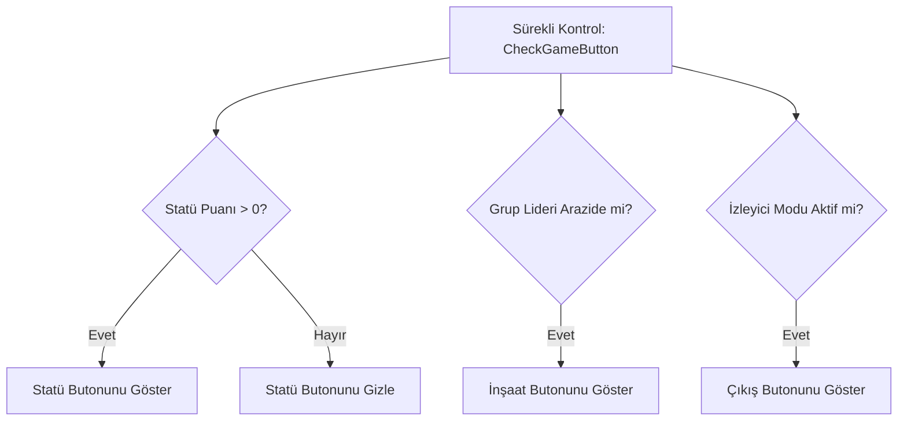

# 🎓 Metin2 Skills: `uiGameButton.py` (Oyun İçi Bildirim Butonları)

`uiGameButton.py`, ekranda belirli durumlarda aniden beliren (örn: seviye atladığında çıkan "+" butonu) etkileşimli bildirim butonlarını yönetir.

---

## 🔍 Neleri Yönetir?

### 1. Dinamik Bildirim Butonları
Oyun durumunu sürekli kontrol ederek (`CheckGameButton`) şu butonları gösterir veya gizler:
- **Statü Artı Butonu (`STATUS`):** Verilmemiş statü puanın (STR, VIT vb.) olduğunda belirir.
- **Beceri Artı Butonu (`SKILL`):** Geliştirilmeye hazır beceri puanın olduğunda belirir.
- **Yardım Butonu (`HELP`):** Oyuna yeni başlayanlara (oyun süresi 0 iken) görünür.

### 2. Özel Durum Butonları
- **Lonca İnşaatı (`BUILD`):** Lonca lideri kendi arazisindeyken bina yapabilmesi için çıkar.
- **İzleyici Modu (`EXIT_OBSERVER`):** Bir savaşı izlerken izleyici modundan çıkmanı sağlar.

### 3. Olay Yönetimi (`SetButtonEvent`)
Bu butonlara tıklandığında hangi pencerenin (örn: Karakter Paneli) açılacağını belirler.

---

## 🛠️ Modifikasyon ve Kritik Uyarılar

### ✅ Yeni Sistem Bildirimleri:
Sunucuna eklediğin "Günlük Hediye", "Battle Pass" veya "Yeni Posta" gibi sistemlerin uyarı butonlarını buradaki `gameButtonDict` içine kopyalayarak ekleyebilirsin.

### ✅ Görsel Efektler:
Butonların sadece sabit durması yerine, dikkat çekmesi için yanıp sönme (Pulse) efekti veya parıltı (Glow) eklemek oyuncu deneyimini iyileştirir.

### ⚠️ Buton Çakışmaları:
`gamewindow.py` tasarım dosyasındaki koordinatlar yanlış ayarlanırsa, birden fazla buton üst üste binerek tıklanmaz hale gelebilir.

---

## 🚨 Hata Ayıklama (Debug)

**"Statü puanım var ama '+' butonu çıkmıyor" sorunu:**
1.  `CheckGameButton` fonksiyonu içindeki `player.GetStatus(player.STAT)` kontrolünün `0`dan büyük olup olmadığını denetle.
2.  `gamewindow.py` dosyasında butonun `show` özelliğinin engellenip engellenmediğine bak.

---

## 📉 uiGameButton.py Karar Şeması

---

**Sonuç:** `uiGameButton.py`, oyunun "Hatırlatıcısıdır". Oyuncuya yapması gereken önemli işlemleri en pratik yoldan bildirir.
