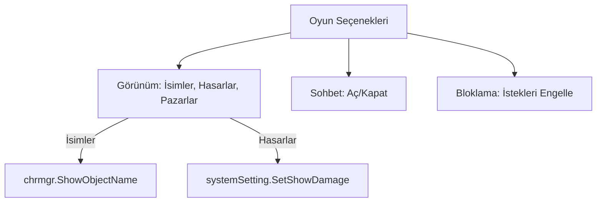

# 🎓 Metin2 Skills: `uiGameOption.py` (Oyun Seçenekleri Paneli)

`uiGameOption.py`, oyunun oynanış tarzını, arayüz görünürlüğünü ve sosyal kısıtlamaları yöneten "Kullanıcı Deneyimi" (UX) panelidir.

---

## 🔍 Neleri Yönetir?

### 1. Görünürlük Ayarları
- **İsimleri Göster:** Karakter ve canavar isimlerinin her zaman mı yoksa sadece fare üzerindeyken mi görüneceğini ayarlar.
- **Hasarları Göster:** Savaş sırasında havada uçuşan hasar rakamlarını açıp kapatır.
- **Pazar Başlıkları:** Pazar kurulduğunda üstte çıkan yazıların görünürlüğünü yönetir.

### 2. Sohbet Ayarları (`view_chat`)
Sohbet penceresinin tamamen gizlenmesini veya görünmesini sağlar.

### 3. Engelleme (Block) Gelişmiş
`uiOption.py`'ye ek olarak "Grup İsteği Engelleme" gibi daha spesifik engelleme modlarını yönetir.

---

## 🛠️ Modifikasyon ve Kritik Uyarılar

### ✅ FPS Artırıcı Toggles (Performans):
Özellikle kalabalık pazar alanlarında veya lonca savaşlarında FPS artırmak için "Petleri Gizle", "Binekleri Gizle" veya "Pazarları Gizle" gibi yeni seçenekler buraya eklenebilir.

### ✅ Gece/Gündüz ve Kar Modu:
Oyunun atmosferini değiştiren bu modların oyuncu tarafından kontrol edilebilmesi için ilgili butonlar bu dosyaya yerleştirilir.

### ⚠️ Damage Render Yükü:
`show_damage` kapalı olsa bile arka planda hesaplama devam eder. Bu ayar sadece görselliği kapatır, işlemci yükünü tamamen sıfırlamaz.

---

## 🚨 Hata Ayıklama (Debug)

**"İsimleri göster diyorum ama hala görünmüyor" sorunu:**
1.  `systemSetting.IsAlwaysShowName()` fonksiyonunun `True` dönüp dönmediğine bak.
2.  `RefreshAlwaysShowName` fonksiyonunun buton tıklandığında tetiklendiğinden emin ol.

---

## 📉 uiGameOption.py Özellik Haritası

---

**Sonuç:** `uiGameOption.py`, oyuncunun oyun içindeki "Görsel Kirliliği" yönettiği ve oyun keyfini kendine göre optimize ettiği yerdir.
