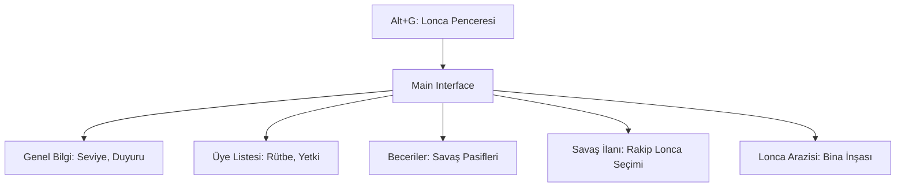

# 🎓 Metin2 Skills: `uiGuild.py` (Lonca Yönetim Sistemi)

`uiGuild.py`, oyundaki sosyal yapının en büyük birimi olan Loncaların tüm detaylarını (Üyeler, Beceriler, Savaşlar ve Araziler) yöneten devasa bir dosyadır. Alt+G ile açılan pencerenin beynidir.

---

## 🔍 Neleri Yönetir?

### 1. Lonca Bilgi Sayfası (`GuildInfoPage`)
Loncanın adı, lideri, seviyesi, tecrübe puanı ve lonca duyurusu gibi temel bilgileri gösterir.

### 2. Üye Listesi ve Yetkiler (`GuildMemberPage`)
Tüm lonca üyelerinin isimlerini, seviyelerini, sınıflarını ve çevrimiçi durumlarını listeler.
- **Yetki Yönetimi:** Kimlerin yeni üye davet edebileceğini, kimlerin lonca becerilerini kullanabileceğini belirleyen "Rütbe" sistemini (`GuildGradePage`) yönetir.

### 3. Lonca Becerileri (`GuildSkillPage`)
Lonca savaşlarında kullanılan özel "Ejderha Tanrısı Yardımı" gibi pasif ve aktif becerilerin seviyelerini ve kullanımını takip eder.

### 4. Lonca Savaşları (`DeclareGuildWarDialog`)
Başka bir loncaya savaş ilan etme sürecini yönetir. Savaş tipini (Normal, Işınlanmalı/Saha) belirlemeyi sağlar.

---

## 🛠️ Modifikasyon ve Kritik Uyarılar

### ✅ Lonca Seviye Sınırını Artırmak:
Standart 20 seviye limitini aşmak istiyorsan, bu dosyada seviye artışını ve EXP hesaplamasını yapan döngüleri sunucuyla uyumlu hale getirmelisin.

### ✅ Gelişmiş Üye Bilgisi:
Üye listesine "Son Görülme" tarihi veya "Bulunduğu Kanal" bilgisini eklemek için `GuildMemberPage` sınıfını ve ilgili paketleri (`net.SendGuild...`) düzenleyebilirsin.

### ⚠️ Yetki Karmaşası:
Eğer yetki verme ekranında bir hata yapılırsa, normal bir üye yanlışlıkla lonca liderini loncadan atabilir veya tüm lonca parasını harcayabilir. Bu yüzden `net.SendGuildChangeMemberGeneralGradePacket` gibi paketler çok dikkatli yönetilmelidir.

---

## 🚨 Hata Ayıklama (Debug)

**"Lonca logosu görünmüyor" veya "Logo yüklenmiyor" sorunu:**
1.  `uiUploadMark.py` ile olan bağlantıyı kontrol et.
2.  `upload` klasörünün yazılabilir olduğundan ve internet bağlantısının logoyu sunucuya ilettiğinden emin ol.

---

## 📉 uiGuild.py Sayfa Haritası

---

**Sonuç:** `uiGuild.py`, oyunun "Sosyal Hiyerarşisidir". Bir sunucudaki rekabetin ve dostluğun teknik olarak yönetildiği en önemli arayüzdür.
