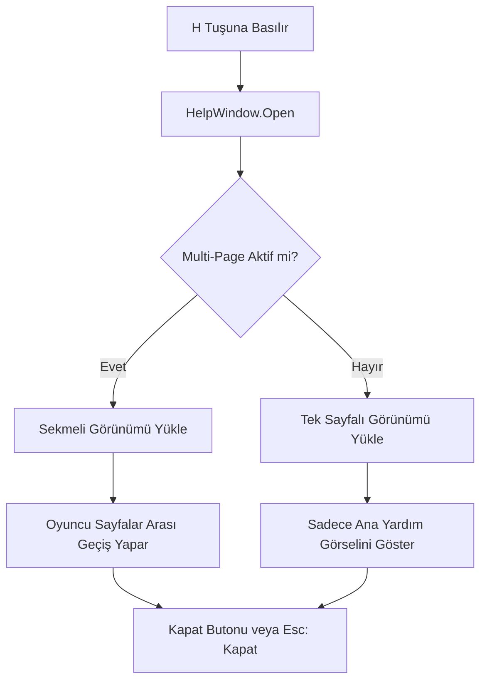

# 🎓 Metin2 Skills: `uiHelp.py` (Yardım ve Kılavuz Penceresi)

`uiHelp.py`, oyuna yeni başlayanlar için temel kontrolleri (hareket, saldırı vb.) gösteren ve 'H' tuşu ile açılan yardım penceresini yönetir.

---

## 🔍 Neleri Yönetir?

### 1. Sayfa Modları
Dosya iki farklı yükleme modunu destekler:
- **Tek Sayfa (`LoadDialogSinglePage`):** Sadece bir adet resim veya yazı gösterir.
- **Çoklu Sayfa (`LoadDialogMultiPage`):** Sekmeler (Tablar) aracılığıyla farklı yardım konuları arasında geçiş yapılmasını sağlar.

### 2. Kısayol Kontrolü
'H' tuşuna basıldığında pencerenin açılmasını veya açıksa kapanmasını denetler. Ayrıca `Esc` tuşuyla kapatılma mantığını içerir.

### 3. Kilitli Görünüm (`Lock/Unlock`)
Yardım penceresi açıkken oyuncunun yanlışlıkla arka planda bir yere tıklamasını engellemek için arayüzü kilitleyebilir.

---

## 🛠️ Modifikasyon ve Kritik Uyarılar

### ✅ Sunucuya Özel Wiki/Rehber:
Standart yardım resimleri yerine, sunucuna özel sistemleri (örn: "Nasıl Kuşak Yapılır?") anlatan yeni sayfalar ve görseller buraya eklenebilir.

### ✅ İnternet Sitesine Yönlendirme:
Yardım penceresinin içine "Daha Fazla Bilgi İçin Tıkla" butonu koyarak oyuncuyu sunucunun forumuna veya Wiki sayfasına yönlendirebilirsin.

### ⚠️ Resim Yolları:
`uiscript/helpwindow.py` içinde tanımlanan resim dosyalarının (`.tga`) yolu yanlışsa, yardım penceresi bomboş veya beyaz görünebilir.

---

## 🚨 Hata Ayıklama (Debug)

**"'H' tuşuna basıyorum ama yardım penceresi gelmiyor" sorunu:**
1.  `ENABLE_HELP_MULTIPAGE` değişkeninin doğru ayarlandığından emin ol.
2.  `LoadDialog` fonksiyonunun `interfaceModule.py` içinde doğru çağrılıp çağrılmadığını kontrol et.

---

## 📉 uiHelp.py İşleyiş Akışı

---

**Sonuç:** `uiHelp.py`, oyuna yeni başlayanlar için "Yol Göstericidir". Karmaşık sistemleri oyuncuya basitleştirerek sunar.
