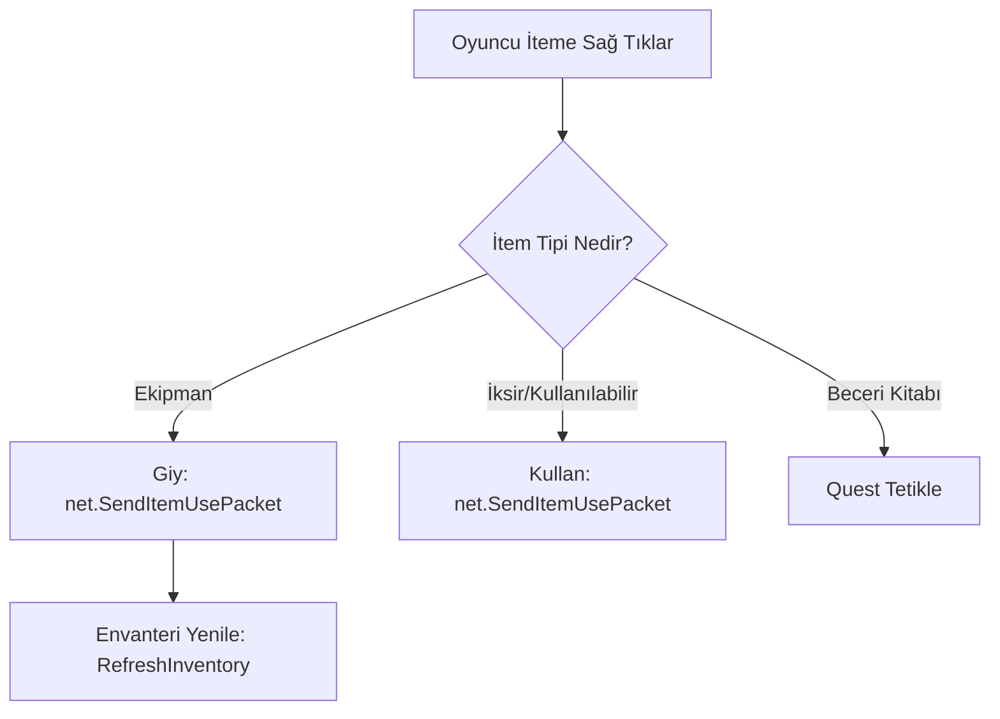

# 🎓 Metin2 Skills: `uiInventory.py` (Envanter Mantığı)

`uiInventory.py`, oyuncunun sahip olduğu tüm eşyaların (İtemlerin) yönetildiği, giyildiği ve kullanıldığı ana merkezdir.

---

## 🔍 Neleri Yönetir?

### 1. Eşya Kullanımı (`UseItemSlot`)
Envanterde bir eşyaya sağ tıkladığında veya çift tıkladığında ne olacağını belirler.
- **İşleyiş:** Kod, eşyanın tipine bakar ve sunucuya "bu eşyayı kullan" paketi (`net.SendItemUsePacket`) gönderir.

### 2. Kostüm ve Kemer Sistemi
Normal envanterin yanındaki "Kostüm" butonu tıklandığında açılan pencerenin (`CostumeWindow`) kodları da burada yer alır.
- **İpucu:** Eğer kostüm penceresi açılmıyorsa, `app.ENABLE_COSTUME_SYSTEM` ayarının aktif olup olmadığına bakılmalıdır.

### 3. Eşya Taşıma ve Sürükleme
Bir eşyayı tutup başka bir slotun üzerine bıraktığında (`SelectItemSlot` ve `SelectEmptySlot`) çalışan mantık buradadır. Eşyanın yerini değiştirmek veya yere atmak (drop) bu fonksiyonlar üzerinden yürütülür.

---

## 🛠️ Modifikasyon ve Kritik Uyarılar

### ✅ Eşya Silme Sistemi Ekleme:
Envantere bir "Çöp Kutusu" ikonu eklemek istersen, sürükleme olayını (`OnTop`) takip edip, eğer eşya çöp kutusuna bırakılmışsa silme komutunu tetikleyen kodu buraya yazmalısın.

### ✅ Envanter Sayfa Sayısını Artırmak:
Standart 2 sayfa envanteri 4 sayfaya çıkarmak için `uiInventory.py` içindeki slot döngülerini ve sayfa butonlarının fonksiyonlarını (örn: `SetInventoryPage`) güncellemen gerekir.

### ⚠️ Slot Çakışmaları:
Eğer slot numaralarını (örn: 0'dan 45'e kadar) yanlış hesaplarsan, envanterdeki bir eşya başka bir eşyanın üzerine biner veya envanterde boş görünen bir yere tıkladığında aslında orada olan gizli bir itemi kullanabilirsin.

---

## 🚨 Hata Ayıklama (Debug)

**"İteme sağ tıklıyorum ama giymiyor/kullanmıyor" sorunu:**
1.  `UseItemSlot` fonksiyonunu kontrol et.
2.  Eğer eşya bir "Quest" eşyasıysa, bazen buradaki kodlar yerine sunucu tarafındaki `quest` dosyaları çalışır.
3.  `syserr.txt` dosyasında `SetItemSlot` hatası varsa, itemin ikonu (`.tga` dosyası) bulunamadığı için slot güncellenemiyor olabilir.

---

## 📉 uiInventory.py Akış Şeması

---

**Sonuç:** `uiInventory.py`, oyuncunun varlığını (eşyalarını) yöneten en kritik arayüz dosyasıdır. Buradaki her bir slot, serverdaki veritabanıyla (MySQL) doğrudan bağlantılıdır.
