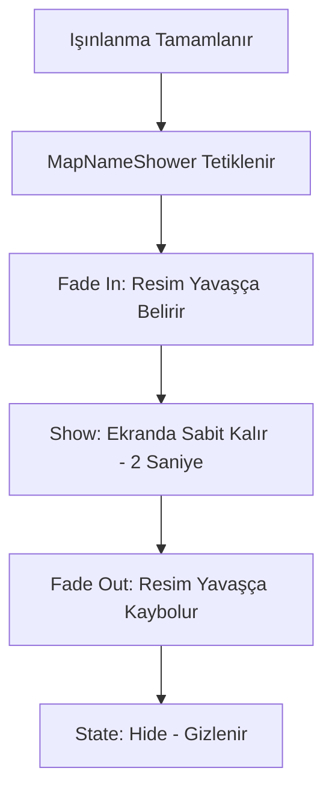

# 🎓 Metin2 Skills: `uiMapNameShower.py` (Harita İsmi Gösterici)

`uiMapNameShower.py`, bir haritaya giriş yaptığında veya ışınlandığında ekranın ortasında beliren o büyük, süslü harita ismini (örn: "Yongan Köyü") yöneten dosyadır.

---

## 🔍 Neleri Yönetir?

### 1. Harita ve Görsel Eşleşmesi (`MAP_NAME_IMAGE`)
Oyunun teknik harita isimlerini (örn: `metin2_map_a1`) karşılık gelen süslü resim dosyalarına (`.tga`) bağlar.

### 2. Fade-In / Fade-Out Efekti
Harita isminin ekrana birden gelip gitmesi yerine, yavaşça belirip (`Fade In`), bir süre ekranda kalıp (`Show`), sonra yavaşça kaybolmasını (`Fade Out`) yönetir.

### 3. Dil Desteği (Locale)
Arapça gibi farklı alfabeler veya diller için farklı resim yollarını (`LOCALE_PATH`) kullanır.

---

## 🛠️ Modifikasyon ve Kritik Uyarılar

### ✅ Yeni Haritalar İçin İsim Ekleme:
Eğer sunucuna yeni bir harita eklediysen, o haritanın adını ekranda göstermek için `MAP_NAME_IMAGE` listesine harita klasör adını ve hazırladığın `.tga` dosyasını eklemelisin.

### ✅ Resim Yerine Yazı Kullanma:
Her harita için ayrı resim hazırlamak yerine, bu dosyayı düzenleyerek harita ismini standart bir "Yazı Tipi" (Font) ile yazdırabilirsin. Bu, dosya boyutunu düşürür ve yeni harita eklemeyi kolaylaştırır.

### ⚠️ Görsel Boyutları:
Hazırlanan `.tga` dosyalarının boyutları ekranı kaplamayacak kadar dengeli olmalıdır. Çok büyük resimler ekranın ortasını tamamen kapatarak oyuncunun görüşünü bozabilir.

---

## 🚨 Hata Ayıklama (Debug)

**"Haritaya giriyorum ama isim çıkmıyor" sorunu:**
1.  `MAP_NAME_IMAGE` içinde o haritanın isminin doğru yazıldığından emin ol (Klasör ismiyle aynı olmalı).
2.  İlgili `.tga` dosyasının `locale/tr/ui/mapname/` klasöründe fiziksel olarak var olduğunu kontrol et.

---

## 📉 uiMapNameShower.py Geçiş Şeması

---

**Sonuç:** `uiMapNameShower.py`, oyuncuya "Neredeyim?" sorusunun cevabını en estetik şekilde veren "Hoş Geldin" tabelasıdır.
